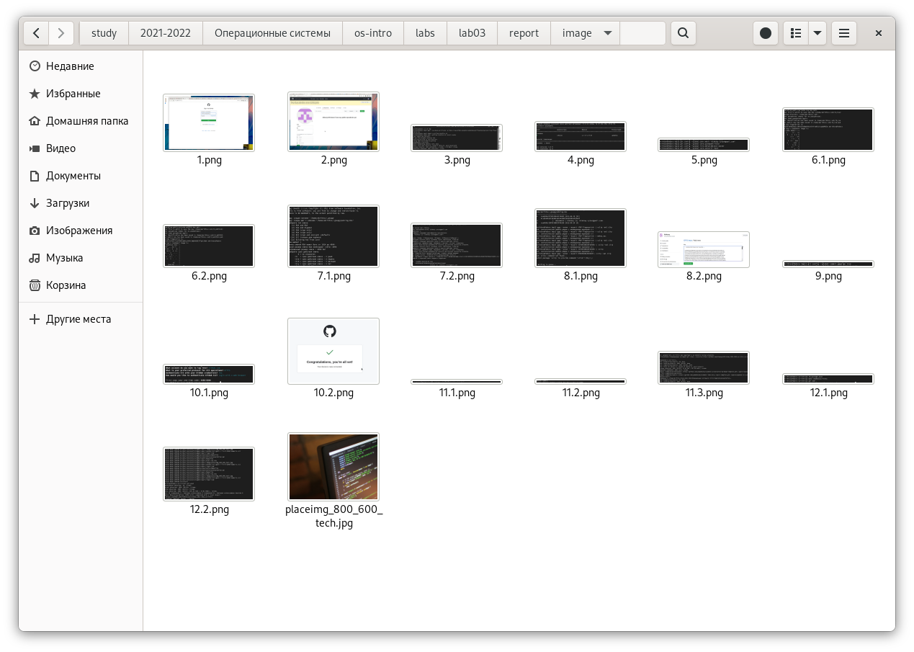
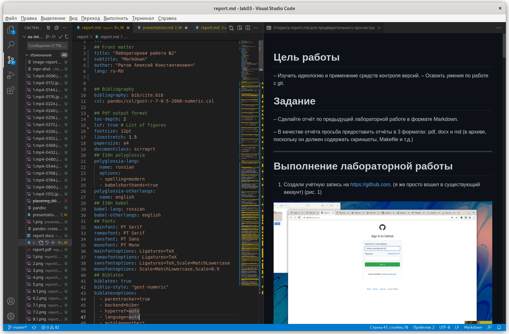
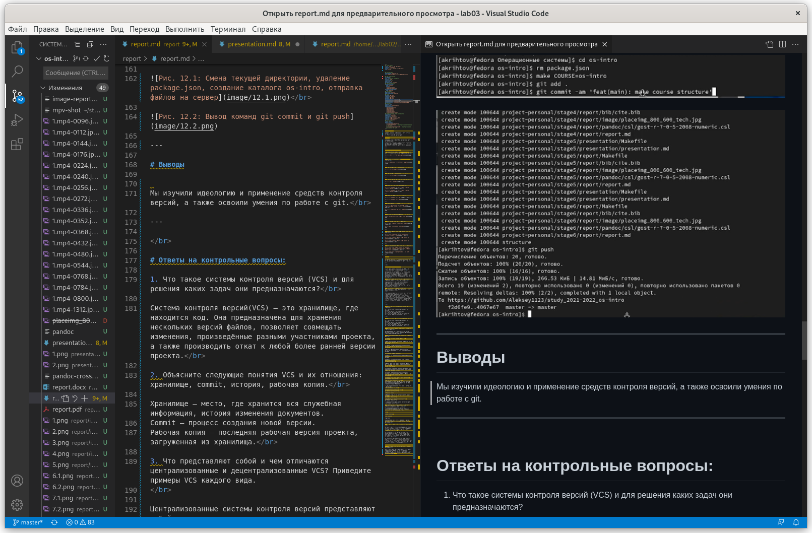
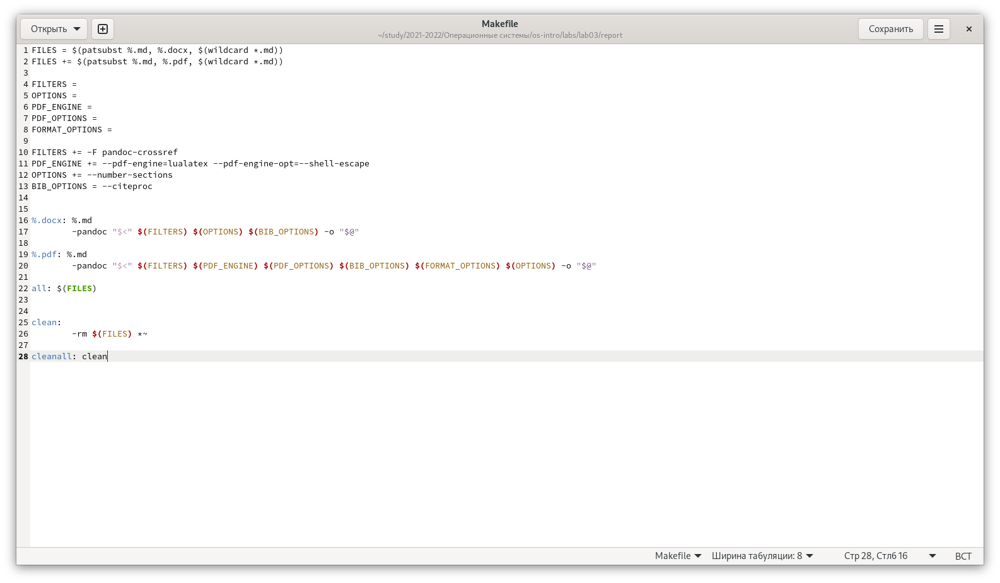
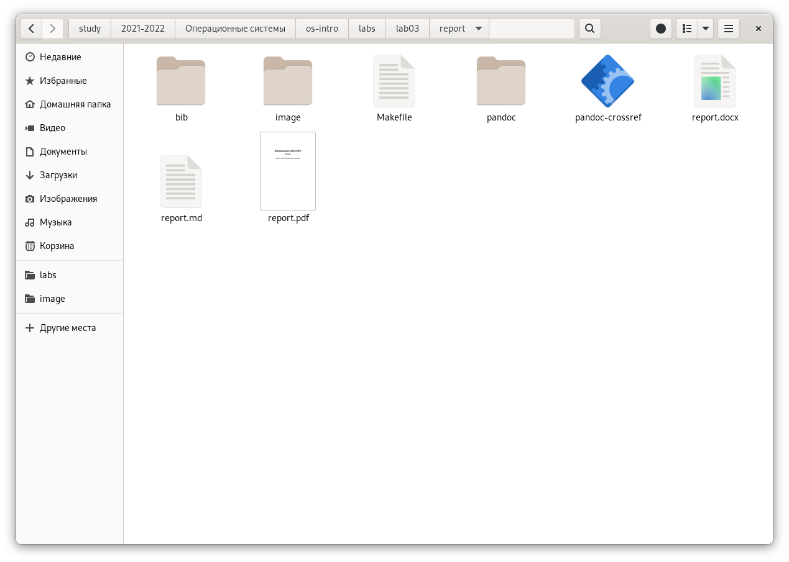

---
## Front matter
lang: ru-RU
title: Защита лабораторной работы №3
author: Рытов Алексей Константинович НФИбд-02-21

## Formatting
toc: false
slide_level: 2
theme: metropolis
header-includes: 
 - \metroset{progressbar=frametitle,sectionpage=progressbar,numbering=fraction}
 - '\makeatletter'
 - '\beamer@ignorenonframefalse'
 - '\makeatother'
aspectratio: 43
section-titles: true
---

# Цель работы

Научиться оформлять отчёты с помощью легковесного языка разметки Markdown.

# Задачи

– Сделать отчёт по Лабораторной работе №2 в формате Markdown

– В качестве отчёта предоставить отчёты в 3 форматах: pdf, docx и md в архиве

# Ход работы

1. Я открыл отчёт к прошлой лабораторной работе и сохранил все скриншоты в папку image себе на виртуальную машину.

---

2. Открыл Visual Studio Code и начал в нём работу с созданным файлом report.md.

---

3. Затем по готовому шаблону сделал отчёт в формате md.

---

4. Затем я скачал Pandoc и с помощью готового Makefile'а преобразовал отчёт формата md в форматы docx и pdf.

---

# Результат работы

Я научился оформлять отчёты с помощью легковесного языка разметки Markdown.