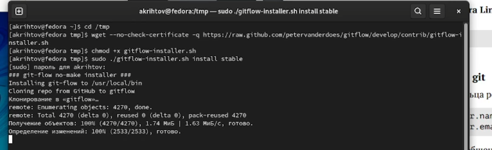

---
## Front matter
title: "Лабораторная работа №2"
subtitle: "Markdown"
author: "Рытов Алексей Константинович"
lang: ru-RU

## Bibliography
bibliography: bib/cite.bib
csl: pandoc/csl/gost-r-7-0-5-2008-numeric.csl

## Pdf output format
toc-depth: 2
lof: true # List of figures
fontsize: 12pt
linestretch: 1.5
papersize: a4
documentclass: scrreprt
## I18n polyglossia
polyglossia-lang:
  name: russian
  options:
	- spelling=modern
	- babelshorthands=true
polyglossia-otherlangs:
  name: english
## I18n babel
babel-lang: russian
babel-otherlangs: english
## Fonts
mainfont: PT Serif
romanfont: PT Serif
sansfont: PT Sans
monofont: PT Mono
mainfontoptions: Ligatures=TeX
romanfontoptions: Ligatures=TeX
sansfontoptions: Ligatures=TeX,Scale=MatchLowercase
monofontoptions: Scale=MatchLowercase,Scale=0.9
## Biblatex
biblatex: true
biblio-style: "gost-numeric"
biblatexoptions:
  - parentracker=true
  - backend=biber
  - hyperref=auto
  - language=auto
  - autolang=other*
  - citestyle=gost-numeric
## Pandoc-crossref LaTeX customization
figureTitle: "Рис."
tableTitle: "Таблица"
listingTitle: "Листинг"
lofTitle: "Список иллюстраций"
lotTitle: "Список таблиц"
lolTitle: "Листинги"
## Misc options
indent: true
header-includes:
  - \usepackage{indentfirst}
  - \usepackage{float} # keep figures where there are in the text
  - \floatplacement{figure}{H} # keep figures where there are in the text
---

# **Цель работы**

– Изучить идеологию и применение средств контроля версий.
 – Освоить умения по работе с git.

# Задание

– Сделайте отчёт по предыдущей лабораторной работе в формате Markdown.

– В качестве отчёта просьба предоставить отчёты в 3 форматах: pdf, docx и md (в архиве,
поскольку он должен содержать скриншоты, Makefile и т.д.)

---

# Выполнение лабораторной работы

1.	Создали учётную запись на https://github.com. (я же просто вошел в существующий аккаунт) (рис. 1) 

---

2. Заполнили основные данные на https://github.com. (рис. 2) 

---

3. Установили git-flow в Fedora Linux. (рис. 3) 

---

4. Установили gh в Fedora Linux. (рис. 4) 

---

5. Произвели базовую настройку git. (рис. 5) 

---

6. Создали ключи ssh. (рис. 6.1 – 6.2) 

 

---

7. Создали ключ pgp. (рис. 7.1 – 7.2) 

 

---

8. Добавили pgp ключ в github. (рис. 7.1 – 7.2) 

 

---

9. Настроили автоматические подписи. (рис. 9) 

---

10. Настроили gh. (рис. 10.1 - 10.2) 

 

---

11. Создали репозиторий курса по шаблону. (рис. 11.1 – 11.3) 

 

 

---

12. Настроили каталога курса. (рис. 12.1 – 12.) 

 

---

# Выводы

Мы изучили идеологию и применение средств контроля версий, а также освоили умения по работе с git. 

---

 

# Ответы на контрольные вопросы:

1. Что такое системы контроля версий (VCS) и для решения каких задач они предназначаются? 

Система контроля версий(VCS) – это хранилище, где находится код. Она предназначена для хранения нескольких версий файлов, позволяет совмещать изменения, произведённые разными участниками проекта, а также производить откат к любой более ранней версии проекта. 

2. Объясните следующие понятия VCS и их отношения: хранилище, commit, история, рабочая копия. 

Хранилище – место, где хранится вся служебная информация, история изменения документов.
Commit – процесс создания новой версии.
Рабочая копия – последняя рабочая версия проекта, загруженная из хранилища. 

3. Что представляют собой и чем отличаются централизованные и децентрализованные VCS? Приведите примеры VCS каждого вида.
 

Централизованные системы контроля версий представляют собой приложения типа клиент-сервер, когда репозиторий проекта существует в единственном экземпляре и хранится на сервере. Доступ к нему осуществлялся через специальное клиентское приложение.
В децентрализованных системах каждый узел принимает свое собственное решение. Конечное поведение системы является совокупностью решений отдельных узлов.

---

 

4. Опишите действия с VCS при единоличной работе с хранилищем.

1) Произвожу блокировку(Lock) последней версии проекта.
2) Выгружаю проект с VCS. (Check-out)
3) Произвожу работу над проектом.
4) Сохраняю и выгружаю проект на VCS. (Check-in)
5) Произвожу разблокировку(Unlock) проекта.

 

5. Опишите порядок работы с общим хранилищем VCS. 

1) Произвожу блокировку(Lock) последней версии проекта.
2) Выгружаю проект с VCS. (Check-out)
3) Произвожу работу над проектом.
4) Сохраняю и выгружаю проект на VCS. (Check-in)
5) Произвожу разблокировку(Unlock) проекта. 

6. Каковы основные задачи, решаемые инструментальным средством git? 

Git предназначен для хранения нескольких версий проекта, позволяет совмещать изменения, произведённые разными участниками проекта. 

7. Назовите и дайте краткую характеристику командам git. 

– создание основного дерева репозитория: 
git init 

– получение обновлений (изменений) текущего дерева из центрального репозитория: 
git pull 

– отправка всех произведённых изменений локального дерева в центральный репозиторий: 
git push 

– просмотр списка изменённых файлов в текущей директории: git status – просмотр текущих изменения:  
git diff

– сохранение текущих изменений: 

– добавить все изменённые и/или созданные файлы и/или каталоги: 
git add  

– добавить конкретные изменённые и/или созданные файлы и/или каталоги: 
git add имена_файлов 

– удалить файл и/или каталог из индекса репозитория (при этом файл и/или каталог остаётся в локальной директории): 
git rm имена_файлов 

– сохранение добавленных изменений: – сохранить все добавленные изменения и все изменённые файлы: 1 git commit -am 'Описание коммита' 

– сохранить добавленные изменения с внесением комментария через встроенный редактор: Кулябов Д. С. и др. Операционные системы 23 
git commit 

– создание новой ветки, базирующейся на текущей: 
git checkout -b имя_ветки 

– переключение на некоторую ветку: 
git checkout имя_ветки (при переключении на ветку, которой ещё нет в локальном репозитории, она будет создана и связана с удалённой)

 – отправка изменений конкретной ветки в центральный репозиторий:
 git push origin имя_ветки 

– слияние ветки с текущим деревом: 
git merge --no-ff имя_ветки 

– удаление ветки: 

– удаление локальной уже слитой с основным деревом ветки: 
git branch -d имя_ветки 

– принудительное удаление локальной ветки: 
git branch -D имя_ветки

 – удаление ветки с центрального репозитория: git push origin :имя_ветки 

8. Приведите примеры использования при работе с локальным и удалённым репозиториями. 

Для инициализации локального репозитория, расположенного, например, в каталоге ~/tutorial, необходимо ввести в командной строке: 

1 cd 

2 mkdir tutorial 

3 cd tutorial 

4 git init

команда status для просмотра изменений в рабочем каталоге, сделанных с момента последней ревизии: 
git status 

9. Что такое и зачем могут быть нужны ветви (branches)? 

Ветка – это просто «скользящий» указатель на один из коммитов. Когда мы создаём новые коммиты, указатель ветки автоматически сдвигается вперёд, к вновь созданному коммиту.  

Ветки используются для разработки одной части функционала изолированно от других. Каждая ветка представляет собой отдельную копию кода проекта. Ветки позволяют одновременно работать над разными версиями проекта.  

Ветвление («ветка», branch) — один из параллельных участков истории в одном хранилище, исходящих из одной версии (точки ветвления). Ветки нужны для того, чтобы программисты могли вести совместную работу над проектом и не мешать друг другу при этом. 

10.  Как и зачем можно игнорировать некоторые файлы при commit? 

Игнорируемые файлы обычно представляют собой файлы, специфичные для платформы, или автоматически созданные из сборочных систем. Временно игнорировать изменения в файле можно командой: git update-index —assume-unchanged <file>

