---
## Front matter
title: "Лабораторная работа №4"
subtitle: "Основы интерфейса взаимодействия пользователя с системой Unix на уровне командной строки"
author: "Рытов Алексей Константинович НФИбд-02-21"
lang: ru-RU

## Bibliography
bibliography: bib/cite.bib
csl: pandoc/csl/gost-r-7-0-5-2008-numeric.csl

## Pdf output format
toc-depth: 2
lof: true # List of figures
fontsize: 12pt
linestretch: 1.5
papersize: a4
documentclass: scrreprt
## I18n polyglossia
polyglossia-lang:
  name: russian
  options:
	- spelling=modern
	- babelshorthands=true
polyglossia-otherlangs:
  name: english
## I18n babel
babel-lang: russian
babel-otherlangs: english
## Fonts
mainfont: PT Serif
romanfont: PT Serif
sansfont: PT Sans
monofont: PT Mono
mainfontoptions: Ligatures=TeX
romanfontoptions: Ligatures=TeX
sansfontoptions: Ligatures=TeX,Scale=MatchLowercase
monofontoptions: Scale=MatchLowercase,Scale=0.9
## Biblatex
biblatex: true
biblio-style: "gost-numeric"
biblatexoptions:
  - parentracker=true
  - backend=biber
  - hyperref=auto
  - language=auto
  - autolang=other*
  - citestyle=gost-numeric
## Pandoc-crossref LaTeX customization
figureTitle: "Рис."
tableTitle: "Таблица"
listingTitle: "Листинг"
lofTitle: "Список иллюстраций"
lotTitle: "Список таблиц"
lolTitle: "Листинги"
## Misc options
indent: true
header-includes:
  - \usepackage{indentfirst}
  - \usepackage{float} # keep figures where there are in the text
  - \floatplacement{figure}{H} # keep figures where there are in the text

---

# Цель работы

Приобретение практических навыков взаимодействия пользователя с системой посредством командной строки.

# Теоретическое введение

В операционной системе типа Linux взаимодействие пользователя с системой обычно
осуществляется с помощью командной строки посредством построчного ввода команд. При этом обычно используется командные интерпретаторы языка shell: /bin/sh;
/bin/csh; /bin/ksh.

**Формат команды.** Командой в операционной системе называется записанный по
специальным правилам текст (возможно с аргументами), представляющий собой указание на выполнение какой-либо функций (или действий) в операционной системе.
Обычно первым словом идёт имя команды, остальной текст — аргументы или опции,
конкретизирующие действие.
Общий формат команд можно представить следующим образом:

<имя_команды><разделитель><аргументы>

**Команда man.** Команда man используется для просмотра (оперативная помощь) в диалоговом режиме руководства (manual) по основным командам операционной системы
типа Linux.
Формат команды:

man <команда>

**Команда cd.** Команда cd используется для перемещения по файловой системе операционной системы типа Linux.

Замечание 1. Файловая система ОС типа Linux — иерархическая система каталогов,
подкаталогов и файлов, которые обычно организованы и сгруппированы по функциональному признаку. Самый верхний каталог в иерархии называется корневым
и обозначается символом /. Корневой каталог содержит системные файлы и другие
каталоги.
Формат команды:

cd [путь_к_каталогу]

Для перехода в домашний каталог пользователя следует использовать команду cd без
параметров или cd ~.

**Команда pwd.** Для определения абсолютного пути к текущему каталогу используется
команда pwd (print working directory).

**Сокращения имён файлов.** В работе с командами, в качестве аргументов которых
выступает путь к какому-либо каталогу или файлу, можно использовать сокращённую
запись пути. 

**Команда ls.** Команда ls используется для просмотра содержимого каталога.
Формат команды:

ls [-опции] [путь]

Некоторые файлы в операционной системе скрыты от просмотра и обычно используются для настройки рабочей среды. Имена таких файлов начинаются с точки. Для
того, чтобы отобразить имена скрытых файлов, необходимо использовать команду ls
с опцией a:

ls -a

Можно также получить информацию о типах файлов (каталог, исполняемый файл,
ссылка), для чего используется опция F.

Чтобы вывести на экран подробную информацию о файлах и каталогах, необходимо
использовать опцию l. При этом о каждом файле и каталоге будет выведена следующая
информация:

– тип файла, 
– право доступа, 
– число ссылок, 
– владелец, 
– размер, 
– дата последней ревизии, 
– имя файла или каталога. 
Пример: 
cd / 
ls

**Команда mkdir.** Команда mkdir используется для создания каталогов.
Формат команды: 
mkdir имя_каталога1 [имя_каталога2...]

**Команда rm.** Команда rm используется для удаления файлов и/или каталогов.
Формат команды: 
rm [-опции] [файл]

Если требуется, чтобы выдавался запрос подтверждения на удаление файла, то необходимо использовать опцию i.
Чтобы удалить каталог, содержащий файлы, нужно использовать опцию r. Без указания
этой опции команда не будет выполняться.

**Команда history.** Для вывода на экран списка ранее выполненных команд используется команда history. Выводимые на экран команды в списке нумеруются. К любой
команде из выведенного на экран списка можно обратиться по её номеру в списке,
воспользовавшись конструкцией !<номер_команды>.

Использование символа «;». Если требуется выполнить последовательно несколько
команд, записанный в одной строке, то для этого используется символ точка с запятой 
Пример: 
cd; ls

---

# Задание

1. Определить полное имя вашего домашнего каталога. Далее относительно этого каталога будут выполняться последующие упражнения.
2. Выполнить следующие действия: 
2.1. Перейти в каталог /tmp. 
2.2. Вывести на экран содержимое каталога /tmp. Для этого использовать команду ls
с различными опциями. Пояснить разницу в выводимой на экран информации. 
2.3. Определить, есть ли в каталоге /var/spool подкаталог с именем cron? 
2.4. Перейти в Ваш домашний каталог и вывести на экран его содержимое. Определить, кто является владельцем файлов и подкаталогов?
3. Выполнить следующие действия: 
3.1. В домашнем каталоге создать новый каталог с именем newdir. 
3.2. В каталоге ~/newdir создать новый каталог с именем morefun. 
3.3. В домашнем каталоге создать одной командой три новых каталога с именами
letters, memos, misk. Затем удалить эти каталоги одной командой. 
3.4. Попробовать удалить ранее созданный каталог ~/newdir командой rm. Проверить,
был ли каталог удалён. 
3.5. Удалить каталог ~/newdir/morefun из домашнего каталога. Проверить, был ли
каталог удалён.
4. С помощью команды man определить, какую опцию команды ls нужно использовать для просмотра содержимое не только указанного каталога, но и подкаталогов,
входящих в него.
5. С помощью команды man определить набор опций команды ls, позволяющий отсортировать по времени последнего изменения выводимый список содержимого каталога
с развёрнутым описанием файлов.
6. Использовать команду man для просмотра описания следующих команд: cd, pwd, mkdir,
rmdir, rm. Пояснить основные опции этих команд.
7. Используя информацию, полученную при помощи команды history, выполнить модификацию и исполнение нескольких команд из буфера команд.

---

# Выполнение лабораторной работы

1.	Определили мия домашнего каталога (рис 4.1). 

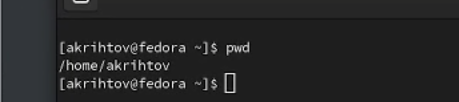

---

2. Выполнили следующие действия: 

2.1. Перешли в каталог /tmp (рис 4.2).

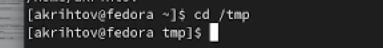

2.2. Вывели на экран содержимое каталога /tmp c помощью команды ls с тремя различными опциями (рис 4.3-5).

.png)

.png)

.png)

2.3. Определили, что в каталоге var/spool нет подкаталога с именем cron (рис. 4.6).

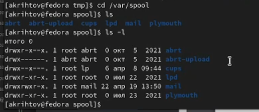

2.4. Перешли в домашний каталог и вывели на экран его содержимое. Определили, что владельцем файлов и подкаталогов является akrihtov(я)(рис. 4.7).

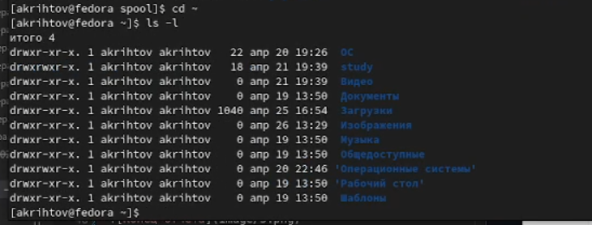

---

3. Выполнить следующие действия: 

3.1. В домашнем каталоге создали новый каталог с именем newdir с помощью команды mkdir(рис. 4.8).

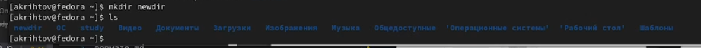

3.2. В каталоге ~/newdir создали новый каталог с именем morefun с помощью команды mkdir(рис 4.9).

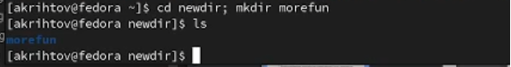

3.3. В домашнем каталоге создали одной командой(mkdir) три новых каталога с именами
letters, memos, misk. Затем удалили эти каталоги одной командой rmdir (рис 4.10-11).

.png)

png.png)

3.4. Попробовали удалить ранее созданный каталог ~/newdir командой rm. Проверили, что он не был удалён(рис. 4.12).

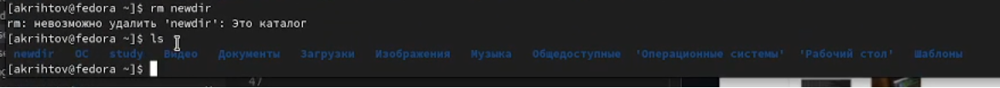

3.5. Удалили каталог ~/newdir/morefun из домашнего каталога. Проверили, что каталог был удалён(рис. 4.13).

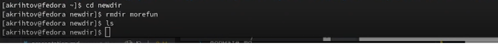

---

4. С помощью команды man определили, какую опцию команды ls нужно использовать для просмотра содержимого не только указанного каталога, но и подкаталогов, входящих в него - это опция R (рис. 4.14-15).

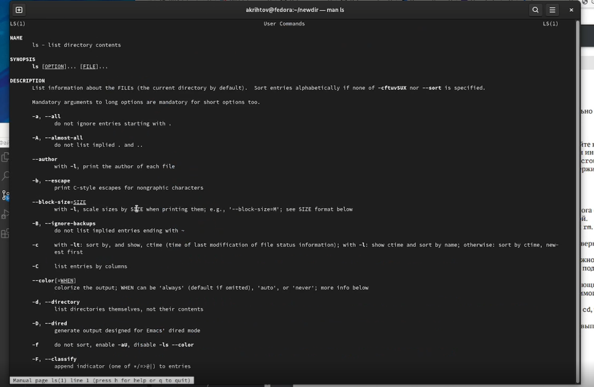

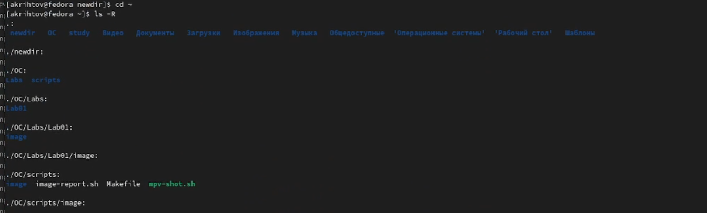

---

5. С помощью команды man определили набор опций команды ls, позволяющий отсортировать по времени последнего изменения выводимый список содержимого каталога с развёрнутым описанием файлов - это набор опций t и l(рис. 4.16-17)

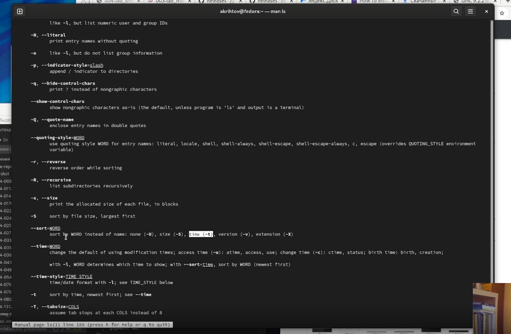

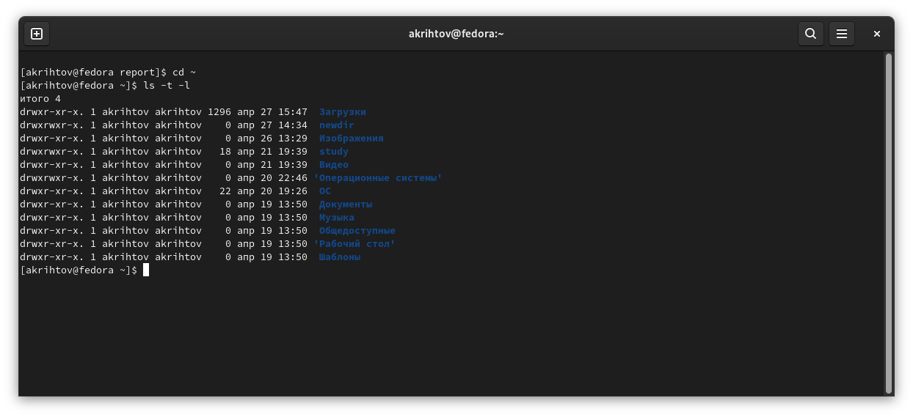

---

6. Использовали команду man для просмотра описания команд (рис 4.18-22): cd, pwd, mkdir, rmdir, rm. Их основные опции:

**cd:**
 
-L переход по символическим ссылкам после того, как были обработаны все переходы .. 
-P позволяет следовать по символическим ссылкам перед тем, как были обработаны все переходы .. 
-e если папку, в которую не удалось перейти не существует, то выдаст ошибку

**pwd:** 
-P отбрасывать все символические ссылки 
--help отобразить справку по утилите 
--version отобразить версию утилиты

**mkdir:** 
-m назначить режим доступа (права) 
-p не показывать ошибки, а также их игнорировать 
-v выводить сообщения о каждом новом каталоге 
--help выводить справочную информацию 
--version выводить информацию о текущей версии утилиты

**rmdir:** 
-/S удаление дерева каталогов 
-/Q отключение запроса на подтверждение удаления дерева каталогов при использовании /S

**rm:** 
-f игнорировать несуществующие фалы или аргументы
-never никогда не выдавать запросы на подтверждение удаления 
-l выдать запрос на подтверждение удаления всех файлов 
-i выводить запрос на подтверждение удаления

---

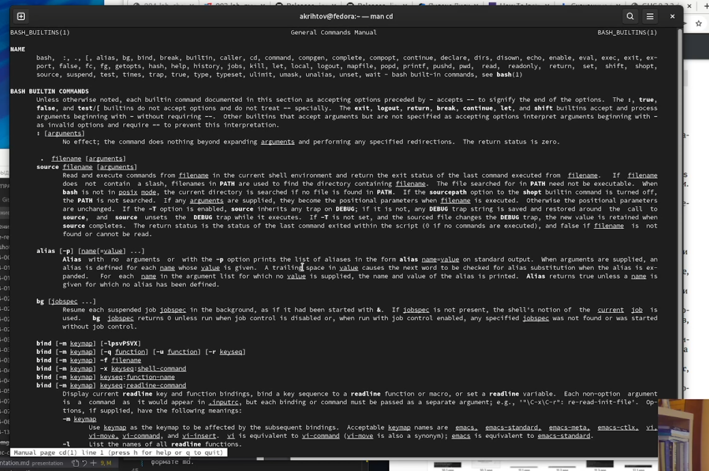

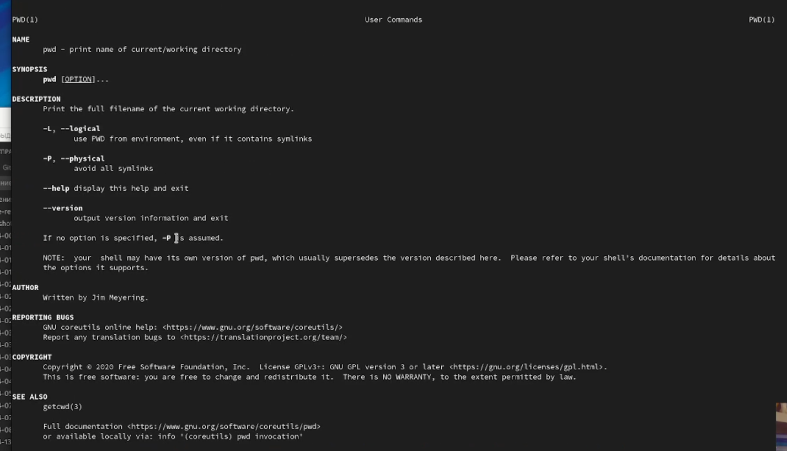

---

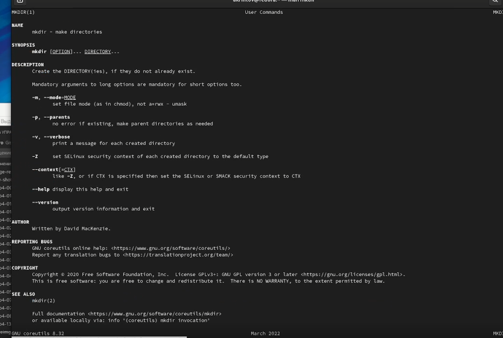

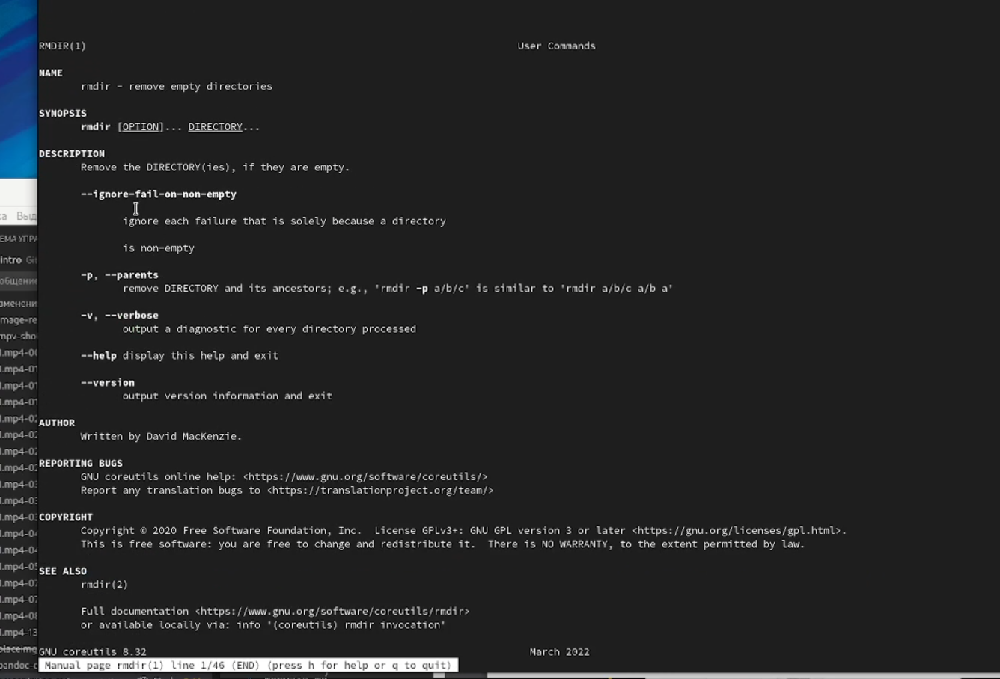

---

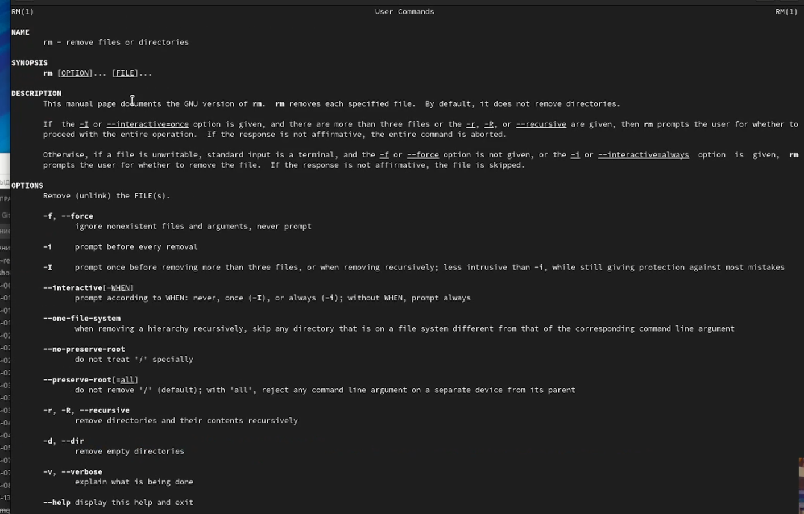

---

7. Используя информацию, полученную при помощи команды history, выполнили модификацию и исполнение команды ls с различными опциями(4.23-24).

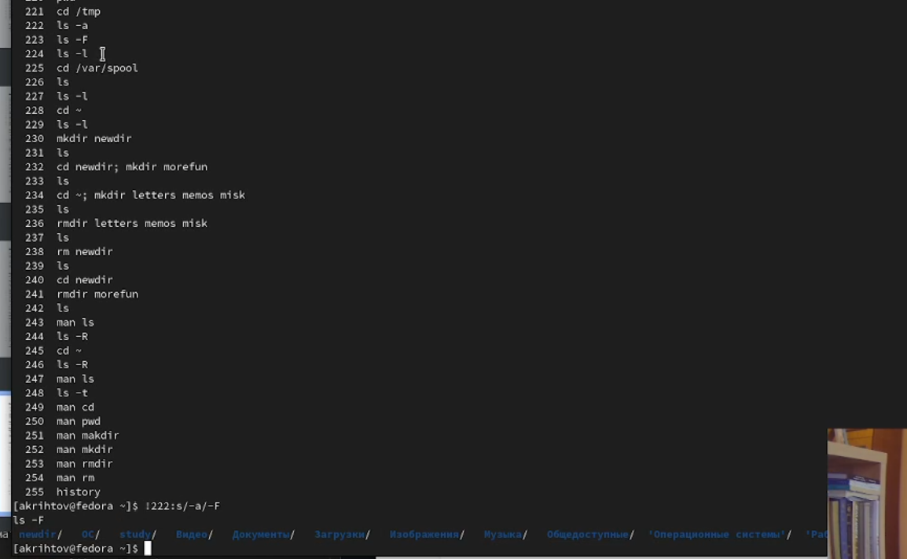

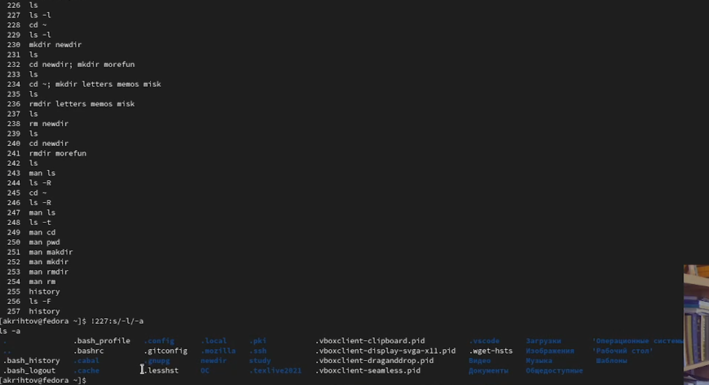

---

# Выводы

Мы приобрели практические навыки взаимодейтсвия с системой посредством командной строки.

# Ответы на контрольные вопросы:

1. **Что такое командная строка?**

*Ответ: Это специальная программа, которая позволяет управлять компьютером путём ввода текстовых команд с клавиатуры.*

2. **При помощи какой команды можно определить абсолютный путь текущего каталога? Приведите пример.**

*Ответ: С помощью команды realpath можно определить абсолютный путь текущего каталога. Пример: Если ввести в консоль realpath ~, то на выходе получим /home/имя_пользователя.*

3. **При помощи какой команды и каких опций можно определить только тип файлов и их имена в текущем каталоге? Приведите примеры.**

*Ответ: С помощью команды ls с опцией -F.*

4. **Каким образом отобразить информацию о скрытых файлах? Приведите примеры.**

*Ответ: С помошью команды ls с опцией -a.*

5. **При помощи каких команд можно удалить файл и каталог? Можно ли это сделать одной и той же командой? Приведите примеры.**

*Ответ: При помощи команд rm и rmdir. Команда rm служит для удаления файлов и директорий, а rmdir для удаления пустых директорий.*

---

6. **Каким образом можно вывести информацию о последних выполненных пользователем командах? работы?**

*Ответ: С помощью команды history.*

7. **Как воспользоваться историей команд для их модифицированного выполнения? Приведите примеры.**

*Ответ:* !<номер_*команды*>:s/<*что*_*меняем*>/<на_что_меняем>.

8. **Приведите примеры запуска нескольких команд в одной строке.**

*Ответ: ls; cd или pwd; ls.*

9. **Дайте определение и приведите примера символов экранирования.**

*Ответ: Это способ заключения в кавычки одиночного символа.*

10. **Охарактеризуйте вывод информации на экран после выполнения команды ls с опцией l.**

*Ответ: Опция l позволяет вывести дополнительную информацию:* 
*-тип файла* 
*-право доступа* 
*-число ссылок* 
*-владелец* 
*-размер* 
*-дата последней ревизии* 
*-имя файла или каталога*

---

11. **Что такое относительный путь к файлу? Приведите примеры использования относительного и абсолютного пути при выполнении какой-либо команды.**

*Ответ: Относительный путь - это только путь относительно текущей папки, а абсолютный путь - это путь относительно текущей папки, но начинающийся с корневого каталога.*

12. **Как получить информацию об интересующей вас команде?**

*Ответ: Используя команду man* <название_команды>.

13. **Какая клавиша или комбинация клавиш служит для автоматического дополнения вводимых команд?**

*Ответ: Клавиша Tab или сочетание клавиш "Alt" + "+".*