---
## Front matter
title: "Лабораторная работа №5"
subtitle: "Анализ файловой системы Linux. Команды для работы с файлами и каталогами"
author: "Рытов Алексей Константинович НФИбд-02-21"
lang: ru-RU

## Bibliography
bibliography: bib/cite.bib
csl: pandoc/csl/gost-r-7-0-5-2008-numeric.csl

## Pdf output format
toc-depth: 2
lof: true # List of figures
fontsize: 12pt
linestretch: 1.5
papersize: a4
documentclass: scrreprt
## I18n polyglossia
polyglossia-lang:
  name: russian
  options:
	- spelling=modern
	- babelshorthands=true
polyglossia-otherlangs:
  name: english
## I18n babel
babel-lang: russian
babel-otherlangs: english
## Fonts
mainfont: PT Serif
romanfont: PT Serif
sansfont: PT Sans
monofont: PT Mono
mainfontoptions: Ligatures=TeX
romanfontoptions: Ligatures=TeX
sansfontoptions: Ligatures=TeX,Scale=MatchLowercase
monofontoptions: Scale=MatchLowercase,Scale=0.9
## Biblatex
biblatex: true
biblio-style: "gost-numeric"
biblatexoptions:
  - parentracker=true
  - backend=biber
  - hyperref=auto
  - language=auto
  - autolang=other*
  - citestyle=gost-numeric
## Pandoc-crossref LaTeX customization
figureTitle: "Рис."
tableTitle: "Таблица"
listingTitle: "Листинг"
lofTitle: "Список иллюстраций"
lotTitle: "Список таблиц"
lolTitle: "Листинги"
## Misc options
indent: true
header-includes:
  - \usepackage{indentfirst}
  - \usepackage{float} # keep figures where there are in the text
  - \floatplacement{figure}{H} # keep figures where there are in the text

---

# Цель работы

Ознакомление с файловой системой Linux, её структурой, именами и содержанием
каталогов. Приобретение практических навыков по применению команд для работы
с файлами и каталогами, по управлению процессами (и работами), по проверке использования диска и обслуживанию файловой системы.

# Теоретическое введение

Для создания текстового файла можно использовать команду touch.
Формат команды: 
touch имя-файла
Для просмотра файлов небольшого размера можно использовать команду cat.
Формат команды: 
cat имя-файла
Для просмотра файлов постранично удобнее использовать команду less.
Формат команды: 
less имя-файла
Следующие клавиши используются для управления процессом просмотра:
– Space — переход к следующей странице, 
– ENTER — сдвиг вперёд на одну строку, 
– b — возврат на предыдущую страницу, 
– h — обращение за подсказкой, 
– q — выход из режима просмотра файла. 
Команда head выводит по умолчанию первые 10 строк файла.
Формат команды: 
head [-n] имя-файла,
где n — количество выводимых строк.
Команда tail выводит умолчанию 10 последних строк файла.
Формат команды: 
tail [-n] имя-файла,
где n — количество выводимых строк.

Команда cp используется для копирования файлов и каталогов.
Формат команды: 
cp [-опции] исходный_файл целевой_файл
Примеры: 
Копирование файла в текущем каталоге. Скопировать файл ~/abc1 в файл april
и в файл may: 
cd 
touch abc1 
cp abc1 april 
cp abc1 may 
Копирование нескольких файлов в каталог. Скопировать файлы april и may в каталог
monthly: 
mkdir monthly 
cp april may monthly 
Копирование файлов в произвольном каталоге.Скопировать файл monthly/may в файл
с именем june: 
cp monthly/may monthly/june 
ls monthly 
Опция i в команде cp выведет на экран запрос подтверждения о перезаписи файла.
Для рекурсивного копирования каталогов, содержащих файлы, используется команда
cp с опцией r. 
Примеры: 
Копирование каталогов в текущем каталоге. Скопировать каталог monthly в каталог
monthly.00: 
mkdir monthly.00 
cp -r monthly monthly.00 
Копирование каталогов в произвольном каталоге. Скопировать каталог monthly.00
в каталог /tmp 
cp -r monthly.00 /tmp

Команды mv и mvdir предназначены для перемещения и переименования файлов
и каталогов.
Формат команды mv:
1 mv [-опции] старый_файл новый_файл
Примеры:
1. Переименование файлов в текущем каталоге. Изменить название файла april на
july в домашнем каталоге:
1 cd
2 mv april july
2. Перемещение файлов в другой каталог. Переместить файл july в каталог monthly.00:
1 mv july monthly.00
2 ls monthly.00
Результат:
1 april july june may
Если необходим запрос подтверждения о перезаписи файла, то нужно использовать
опцию i.
3. Переименование каталогов в текущем каталоге. Переименовать каталог monthly.00
в monthly.01
1 mv monthly.00 monthly.01
4. Перемещение каталога в другой каталог. Переместить каталог monthly.01в каталог
reports:
1 mkdir reports
2 mv monthly.01 reports
5. Переименование каталога, не являющегося текущим. Переименовать каталог
reports/monthly.01 в reports/monthly:
1 mv reports/monthly.01 reports/monthly
5.2.4. Права доступа
Каждый файл или каталог имеет права доступа (табл. 5.1).
В сведениях о файле или каталоге указываются:
– тип файла (символ (-) обозначает файл, а символ (d) — каталог);
– права для владельца файла (r — разрешено чтение, w — разрешена запись, x — разрешено выполнение, - — право доступа отсутствует);
– права для членов группы (r — разрешено чтение, w — разрешена запись, x — разрешено
выполнение, - — право доступа отсутствует);
– права для всех остальных (r — разрешено чтение, w — разрешена запись, x — разрешено
выполнение, - — право доступа отсутствует).
Примеры:
Кулябов Д. С. и др. Операционные системы 49
Таблица 5.1
Права доступа
Право Обозначение Файл Каталог
Чтение r Разрешены просмотр
и копирование
Разрешён просмотр
списка входящих
файлов
Запись w Разрешены
изменение и переименование
Разрешены создание
и удаление файлов
Выполнение x Разрешено выполнение файла (скриптов
и/или программ)
Разрешён доступ
в каталог и есть возможность сделать его
текущим 
Для файла (крайнее левое поле имеет значение -) владелец файла имеет право на
чтение и запись (rw-), группа, в которую входит владелец файла, может читать файл
(r--), все остальные могут читать файл (r--): 
-rw-r--r-- 
Только владелец файла имеет право на чтение, изменение и выполнение файла: 
-rwx------ 
Владелец каталога (крайнее левое поле имеет значение d) имеет право на просмотр,
изменение и доступа в каталог, члены группы могут входить и просматривать его, все
остальные — только входить в каталог: 
drwxr-x--x 
Изменение прав доступа
Права доступа к файлу или каталогу можно изменить, воспользовавшись командой
chmod. Сделать это может владелец файла (или каталога) или пользователь с правами
администратора.
Формат команды: 
chmod режим имя_файла
Режим (в формате команды) имеет следующие компоненты структуры и способ записи: 
= установить право 
- лишить права 
+ дать право 
r чтение 
w запись 
x выполнение 
u (user) владелец файла 
g (group) группа, к которой принадлежит владелец файла 
o (others) все остальные 
В работе с правами доступа можно использовать их цифровую запись (восьмеричное
значение) вместо символьной

---

# Выполнение лабораторной работы

1. Выполнили все примеры, приведённые в первой части описания лабораторной работы.(рис. 1-3)

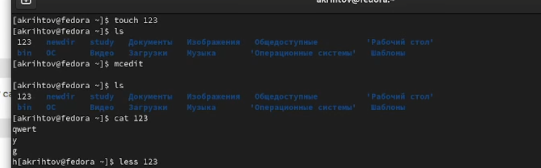

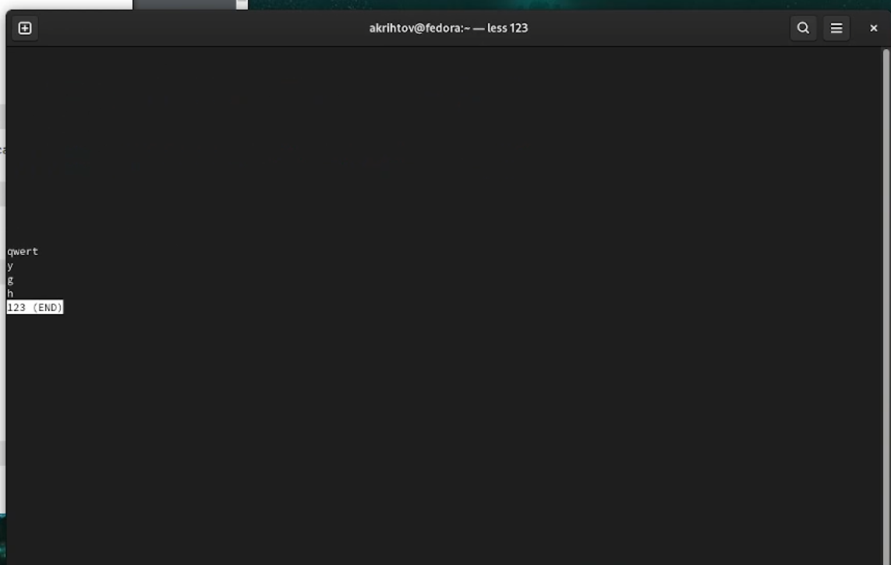

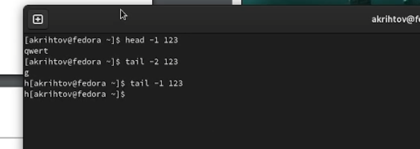

2.1. Скопировали файл /usr/include/sys/io.h в домашний каталог и назвали его
equipment.(рис. 4-5)

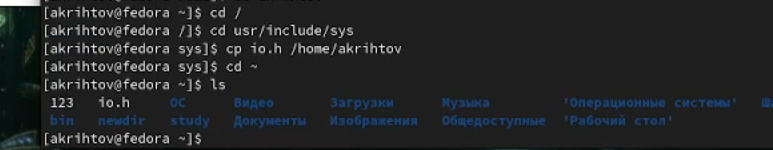

2.2. В домашнем каталоге создали директорию ~/ski.plases. 
2.3. Переместили файл equipment в каталог ~/ski.plases. 
2.4. Переименовали файл ~/ski.plases/equipment в ~/ski.plases/equiplist.(рис. 6)

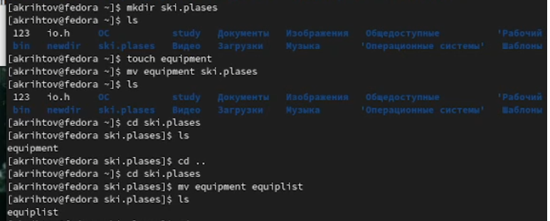

2.5. Создали в домашнем каталоге файл abc1 и скопировали его в каталог
~/ski.plases, назовите его equiplist2.(рис. 7-8)

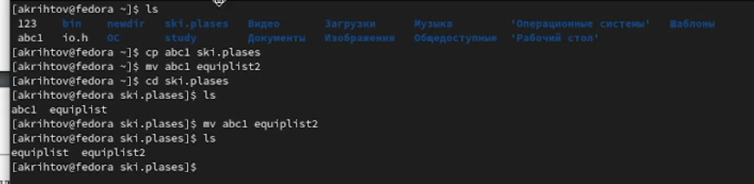

2.6. Создали каталог с именем equipment в каталоге ~/ski.plases. 
2.7. Переместили файлы ~/ski.plases/equiplist и equiplist2 в каталог
~/ski.plases/equipment. 
2.8. Создали и переместили каталог ~/newdir в каталог ~/ski.plases и назвали
его plans.(рис. 9)

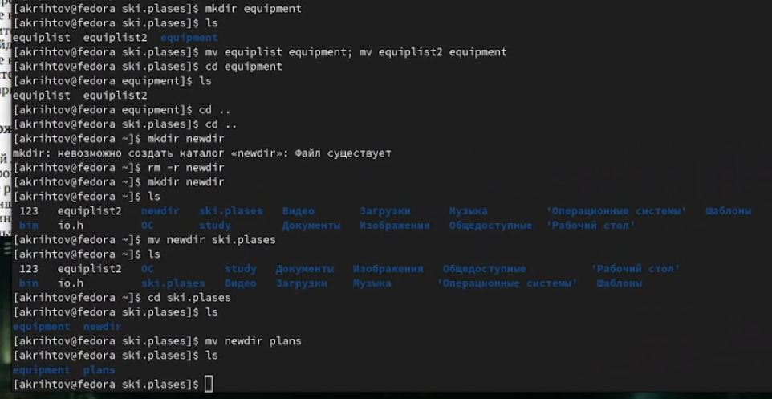

3. Определили опции команды chmod, необходимые для того, чтобы присвоить перечисленным ниже файлам выделенные права доступа. 
3.1. drwxr--r-- ... australia 
3.2. drwx--x--x ... play 
3.3. -r-xr--r-- ... my_os 
3.4. -rw-rw-r-- ... feathers(рис. 10-11)

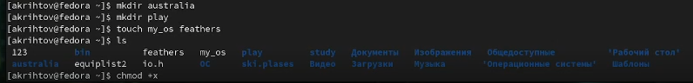

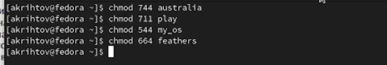

4.1. Просмотрели содержимое файла /etc/password.(рис. 12)

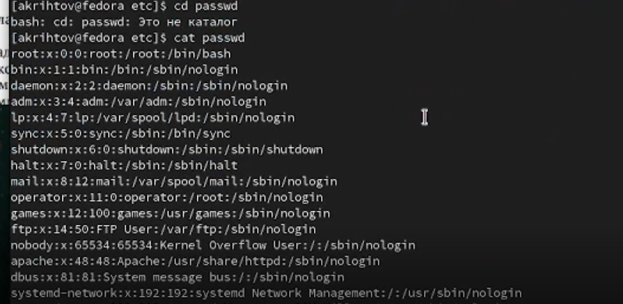

4.2. Скопировали файл ~/feathers в файл ~/file.old. 
4.3. Переместили файл ~/file.old в каталог ~/play. 
4.4. Скопировали каталог ~/play в каталог ~/fun.(рис. 13)

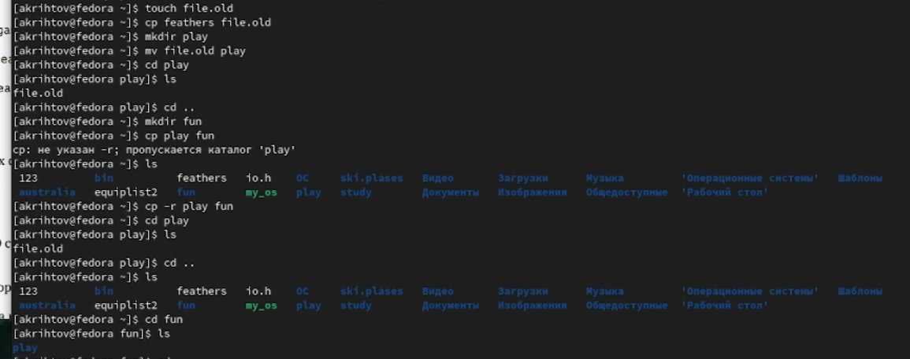

4.5. Переместили каталог ~/fun в каталог ~/play и назвали его games.(рис.14)

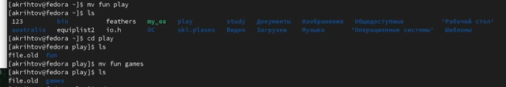

4.6 - 4.8 Лишили владельца файла ~/feathers права на чтение. Попытались просмотреть файл командой cat. В итоге нав выдало ошибку. Попробовав скопировать файл ~/feathers мы также получили в консоли ошибку. 
4.9. Дали владельцу файла ~/feathers право на чтение. 
4.10. Лишили владельца каталога ~/play права на выполнение. 
4.11. Попытались перейти в каталог ~/play. Нам вывело ошибку. 
4.12. Дали владельцу каталога ~/play право на выполнение.(рис.15)

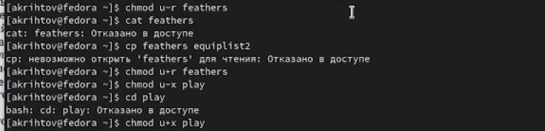

5. Использовали команду man для команд mount, fsck, mkfs, kill.(рис. 16-20)

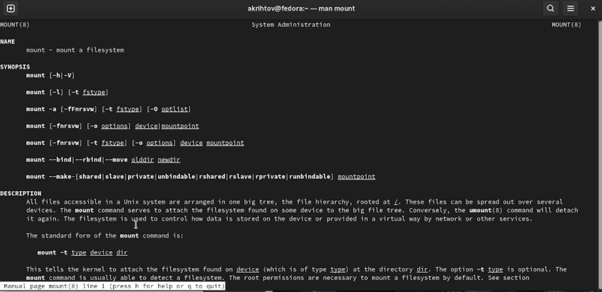

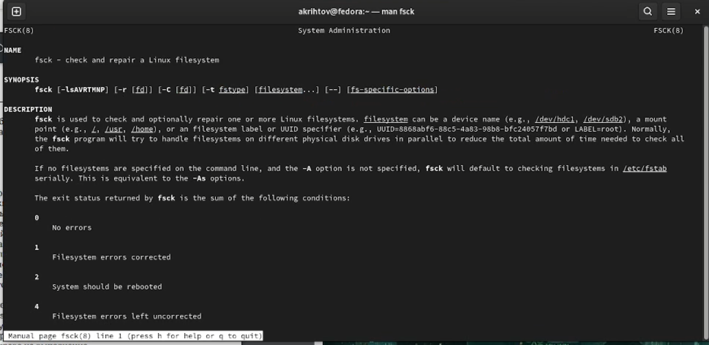

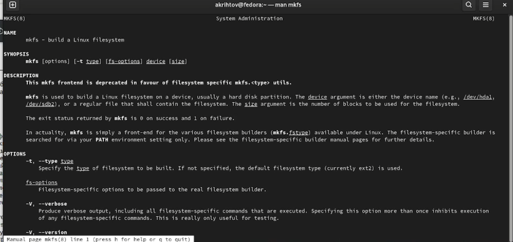

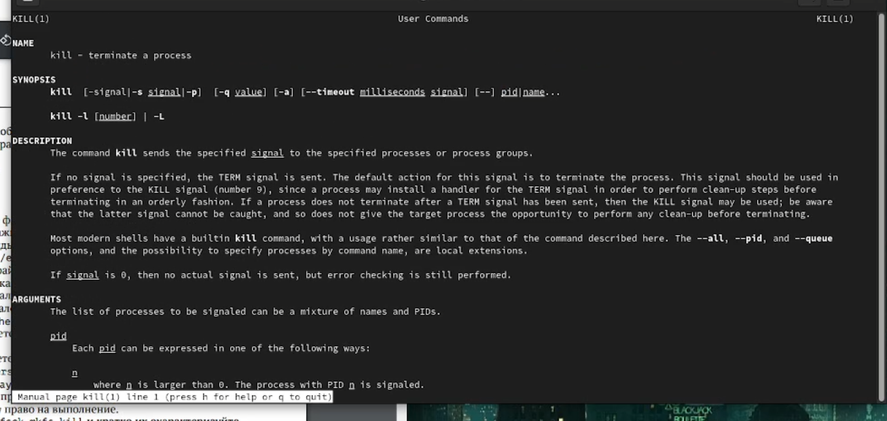

mount: Эта команда позволяет монтировать отделы жёсткого диска, к файловой структуре ОС.

mount -t vfstype device dir 
Такая команда предлагает ядру смонтировать (подключить) файловую систему указанного типа vfstype, расположенную на устройстве device, к заданному каталогу dir, который часто называют точкой монтирования. Предыдущее содержимое, владелец и режим доступа к каталогу dir становятся недоступными (исчезают), а вновь появившиеся продолжают действовать, пока файловая система device смонтирована (подключена) к dir.

fsck: Используется для восстановления поврежденных файловых систем в ситуациях, когда система не загружается или раздел не может быть смонтирован.

fsck [OPTIONS] [FILESYSTEM]

mkfs: Команда обычно используется для управления устройствами хранения в Linux. Вы можете рассматривать mkfs как инструмент командной строки для форматирования диска в определенной файловой системе.

mkfs -t [fs type] [target device]

kill: Чаще всего данная команда используется для принудительного завершения работы определенных процессов.

kill [параметры] идентификатор-процесса

# Выводы

Мы ознакомились с файловой системой Linux, её структурой, именами и содержанием
каталогов. Приобрели практические навыки по применению команд для работы
с файлами и каталогами, по управлению процессами, по проверке использования диска и обслуживанию файловой системы.

# Ответы на контрольные вопросы:

1. Дайте характеристику каждой файловой системе, существующей на жёстком диске
компьютера, на котором вы выполняли лабораторную работу.

Ext2, Ext3, Ext4 или Extended Filesystem - это стандартная файловая система для Linux. Она была разработана еще для Minix. Она самая стабильная из всех существующих, кодовая база изменяется очень редко и эта файловая система содержит больше всего функций. Версия ext2 была разработана уже именно для Linux и получила много улучшений. В 2001 году вышла ext3, которая добавила еще больше стабильности благодаря использованию журналирования. В 2006 была выпущена версия ext4, которая используется во всех дистрибутивах Linux до сегодняшнего дня. В ней было внесено много улучшений, в том числе увеличен максимальный размер раздела до одного экзабайта.

JFS или Journaled File System была разработана в IBM для AIX UNIX и использовалась в качестве альтернативы для файловых систем ext. Сейчас она используется там, где необходима высокая стабильность и минимальное потребление ресурсов. При разработке файловой системы ставилась цель создать максимально эффективную файловую систему для многопроцессорных компьютеров. Также как и ext, это журналируемая файловая система, но в журнале хранятся только метаданные, что может привести к использованию старых версий файлов после сбоев.

ReiserFS - была разработана намного позже, в качестве альтернативы ext3 с улучшенной производительностью и расширенными возможностями. Она была разработана под руководством Ганса Райзера и поддерживает только Linux. Из особенностей можно отметить динамический размер блока, что позволяет упаковывать несколько небольших файлов в один блок, что предотвращает фрагментацию и улучшает работу с небольшими файлами. Еще одно преимущество - в возможности изменять размеры разделов на лету. Но минус в некоторой нестабильности и риске потери данных при отключении энергии. Раньше ReiserFS применялась по умолчанию в SUSE Linux, но сейчас разработчики перешли на Btrfs.

XFS - это высокопроизводительная файловая система, разработанная в Silicon Graphics для собственной операционной системы еще в 2001 году. Она изначально была рассчитана на файлы большого размера, и поддерживала диски до 2 Терабайт. Из преимуществ файловой системы можно отметить высокую скорость работы с большими файлами, отложенное выделение места, увеличение разделов на лету и незначительный размер служебной информации.

XFS - журналируемая файловая система, однако в отличие от ext, в журнал записываются только изменения метаданных. Она используется по умолчанию в дистрибутивах на основе Red Hat. Из недостатков - это невозможность уменьшения размера, сложность восстановления данных и риск потери файлов при записи, если будет неожиданное отключение питания, поскольку большинство данных находится в памяти.

+Btrfs или B-Tree File System - это совершенно новая файловая система, которая сосредоточена на отказоустойчивости, легкости администрирования и восстановления данных. Файловая система объединяет в себе очень много новых интересных возможностей, таких как размещение на нескольких разделах, поддержка подтомов, изменение размера не лету, создание мгновенных снимков, а также высокая производительность. Но многими пользователями файловая система Btrfs считается нестабильной. Тем не менее, она уже используется как файловая система по умолчанию в OpenSUSE и SUSE Linux.

2. Приведите общую структуру файловой системы и дайте характеристику каждой директории первого уровня этой структуры.

/ — root каталог. Содержит в себе всю иерархию системы;

/bin — здесь находятся двоичные исполняемые файлы. Основные общие команды, хранящиеся отдельно от других программ в системе (прим.: pwd, ls, cat, ps);

/boot — тут расположены файлы, используемые для загрузки системы (образ initrd, ядро vmlinuz);

/dev — в данной директории располагаются файлы устройств (драйверов). С помощью этих файлов можно взаимодействовать с устройствами. К примеру, если это жесткий диск, можно подключить его к файловой системе. В файл принтера же можно написать напрямую и отправить задание на печать;

/etc — в этой директории находятся файлы конфигураций программ. Эти файлы позволяют настраивать системы, сервисы, скрипты системных демонов;

/home — каталог, аналогичный каталогу Users в Windows. Содержит домашние каталоги учетных записей пользователей (кроме root). При создании нового пользователя здесь создается одноименный каталог с аналогичным именем и хранит личные файлы этого пользователя;

/lib — содержит системные библиотеки, с которыми работают программы и модули ядра;

/lost+found — содержит файлы, восстановленные после сбоя работы системы. Система проведет проверку после сбоя и найденные файлы можно будет посмотреть в данном каталоге;

/media — точка монтирования внешних носителей. Например, когда вы вставляете диск в дисковод, он будет автоматически смонтирован в директорию /media/cdrom;

/mnt — точка временного монтирования. Файловые системы подключаемых устройств обычно монтируются в этот каталог для временного использования;

/opt — тут расположены дополнительные (необязательные) приложения. Такие программы обычно не подчиняются принятой иерархии и хранят свои файлы в одном подкаталоге (бинарные, библиотеки, конфигурации);

/proc — содержит файлы, хранящие информацию о запущенных процессах и о состоянии ядра ОС;

/root — директория, которая содержит файлы и личные настройки суперпользователя;

/run — содержит файлы состояния приложений. Например, PID-файлы или UNIX-сокеты;

/sbin — аналогично /bin содержит бинарные файлы. Утилиты нужны для настройки и администрирования системы суперпользователем;

/srv — содержит файлы сервисов, предоставляемых сервером (прим. FTP или Apache HTTP);

/sys — содержит данные непосредственно о системе. Тут можно узнать информацию о ядре, драйверах и устройствах;

/tmp — содержит временные файлы. Данные файлы доступны всем пользователям на чтение и запись. Стоит отметить, что данный каталог очищается при перезагрузке;

/usr — содержит пользовательские приложения и утилиты второго уровня, используемые пользователями, а не системой. Содержимое доступно только для чтения (кроме root). Каталог имеет вторичную иерархию и похож на корневой;

/var — содержит переменные файлы. Имеет подкаталоги, отвечающие за отдельные переменные. Например, логи будут храниться в /var/log, кэш в /var/cache, очереди заданий в /var/spool/ и так далее.

3. Какая операция должна быть выполнена, чтобы содержимое некоторой файловой
системы было доступно операционной системе?

Монтирование тома.

4. Назовите основные причины нарушения целостности файловой системы. Как устранить повреждения файловой системы?

Отсутствие синхронизации между образом файловой системы в памяти и ее данными на диске в случае аварийного останова может привести к появлению следующих ошибок:

1. Один блок адресуется несколькими mode (принадлежит нескольким файлам).

2. Блок помечен как свободный, но в то же время занят (на него ссылается onode).

3. Блок помечен как занятый, но в то же время свободен (ни один inode на него не ссылается).

4. Неправильное число ссылок в inode (недостаток или избыток ссылающихся записей в каталогах).

5. Несовпадение между размером файла и суммарным размером адресуемых inode блоков.

6. Недопустимые адресуемые блоки (например, расположенные за пределами файловой системы).

7. "Потерянные" файлы (правильные inode, на которые не ссылаются записи каталогов).

8. Недопустимые или неразмещенные номера inode в записях каталогов.

5. Как создаётся файловая система?

С помощью команды mkfs.

6. Дайте характеристику командам для просмотра текстовых файлов.

Cat - выводит содержимое файла на стандартное устройство вывода. Для просмотра файлов постранично удобнее использовать команду less.

7. Приведите основные возможности команды cp в Linux.

Команда cp используется для копирования файлов и каталогов.
Формат команды: 
cp [-опции] исходный_файл целевой_файл

8. Приведите основные возможности команды mv в Linux.

Команда mv редназначена для перемещения и переименования файлов и каталогов.
Формат команды mv:

mv [-опции] старый_файл новый_файл

9. Что такое права доступа? Как они могут быть изменены?

Права доступа к файлу или каталогу можно изменить, воспользовавшись командой chmod. Сделать это может владелец файла (или каталога) или пользователь с правами администратора.

