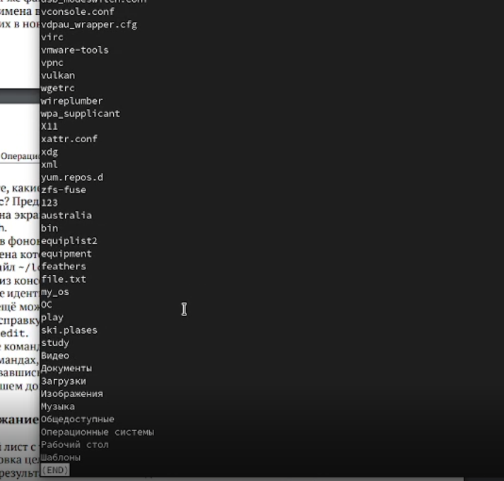
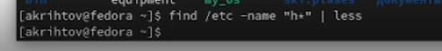

---
## Front matter
title: "Лабораторная работа №6"
subtitle: " Поиск файлов. Перенаправление ввода-вывода. Просмотр запущенных процессов"
author: "Рытов Алексей Константинович НФИбд-02-21"
lang: ru-RU

## Bibliography
bibliography: bib/cite.bib
csl: pandoc/csl/gost-r-7-0-5-2008-numeric.csl

## Pdf output format
toc-depth: 2
lof: true # List of figures
fontsize: 12pt
linestretch: 1.5
papersize: a4
documentclass: scrreprt
## I18n polyglossia
polyglossia-lang:
  name: russian
  options:
	- spelling=modern
	- babelshorthands=true
polyglossia-otherlangs:
  name: english
## I18n babel
babel-lang: russian
babel-otherlangs: english
## Fonts
mainfont: PT Serif
romanfont: PT Serif
sansfont: PT Sans
monofont: PT Mono
mainfontoptions: Ligatures=TeX
romanfontoptions: Ligatures=TeX
sansfontoptions: Ligatures=TeX,Scale=MatchLowercase
monofontoptions: Scale=MatchLowercase,Scale=0.9
## Biblatex
biblatex: true
biblio-style: "gost-numeric"
biblatexoptions:
  - parentracker=true
  - backend=biber
  - hyperref=auto
  - language=auto
  - autolang=other*
  - citestyle=gost-numeric
## Pandoc-crossref LaTeX customization
figureTitle: "Рис."
tableTitle: "Таблица"
listingTitle: "Листинг"
lofTitle: "Список иллюстраций"
lotTitle: "Список таблиц"
lolTitle: "Листинги"
## Misc options
indent: true
header-includes:
  - \usepackage{indentfirst}
  - \usepackage{float} # keep figures where there are in the text
  - \floatplacement{figure}{H} # keep figures where there are in the text

---

# Цель работы

Ознакомление с инструментами поиска файлов и фильтрации текстовых данных.
Приобретение практических навыков: по управлению процессами (и заданиями), по
проверке использования диска и обслуживанию файловых систем.

# Теоретическое введение

В системе по умолчанию открыто три специальных потока:
– stdin — стандартный поток ввода (по умолчанию: клавиатура), файловый дескриптор
0;
– stdout — стандартный поток вывода (по умолчанию: консоль), файловый дескриптор
1;
– stderr — стандартный поток вывод сообщений об ошибках (по умолчанию: консоль),
файловый дескриптор 2.
Большинство используемых в консоли команд и программ записывают результаты
своей работы в стандартный поток вывода stdout. Например, команда ls выводит в стандартный поток вывода (консоль) список файлов в текущей директории. Потоки вывода
и ввода можно перенаправлять на другие файлы или устройства. Проще всего это делается
с помощью символов >, >>, <, <<. 

Конвейер (pipe) служит для объединения простых команд или утилит в цепочки, в которых результат работы предыдущей команды передаётся последующей. Синтаксис
следующий:
1 команда 1 | команда 2
2 # означает, что вывод команды 1 передастся на ввод команде 2
Конвейеры можно группировать в цепочки и выводить с помощью перенаправления
в файл, например:
1 ls -la |sort > sortilg_list
вывод команды ls -la передаётся команде сортировки sort\verb, которая пишет результат в файл sorting_list\verb.
Чаще всего скрипты на Bash используются в качестве автоматизации каких-то рутинных операций в консоли, отсюда иногда возникает необходимость в обработке stdout
одной команды и передача на stdin другой команде, при этом результат выполнения
команды должен обработан.

Команда find используется для поиска и отображения на экран имён файлов, соответствующих заданной строке символов.
Формат команды:
1 find путь [-опции]
Путь определяет каталог, начиная с которого по всем подкаталогам будет вестись
поиск.
Примеры:
1. Вывести на экран имена файлов из вашего домашнего каталога и его подкаталогов,
начинающихся на f:
1 find ~ -name "f*" -print
Здесь ~ — обозначение вашего домашнего каталога, -name — после этой опции указывается имя файла, который нужно найти, "f*" — строка символов, определяющая имя
файла, -print — опция, задающая вывод результатов поиска на экран.
2. Вывести на экран имена файлов в каталоге /etc, начинающихся с символа p:
1 find /etc -name "p*" -print
3. Найти в Вашем домашнем каталоге файлы, имена которых заканчиваются символом
~ и удалить их:
1 find ~ -name "*~" -exec rm "{}" \;
Здесь опция -exec rm "{}" \; задаёт применение команды rm ко всем файлам, имена которых соответствуют указанной после опции -name строке символов.
Для просмотра опций команды find воспользуйтесь командой man.

Найти в текстовом файле указанную строку символов позволяет команда grep.
Формат команды:
1 grep строка имя_файла
Кроме того, команда grep способна обрабатывать стандартный вывод других команд
(любой текст). Для этого следует использовать конвейер, связав вывод команды с вводом
grep.
Примеры:
1. Показать строки во всех файлах в вашем домашнем каталоге с именами, начинающимися на f, в которых есть слово begin:
1 grep begin f*
2. Найти в текущем каталоге все файлы, содержащих в имени «лаб»:
1 ls -l | grep лаб

Команда df показывает размер каждого смонтированного раздела диска.
Формат команды:
1 df [-опции] [файловая_система]
Пример:
1 df -vi
Команда du показывает число килобайт, используемое каждым файлом или каталогом.
Формат команды:
1 du [-опции] [имя_файла...]
Пример.
1 du -a ~/
На afs можно посмотреть использованное пространство командой
1 fs quota

---

# Выполнение лабораторной работы

1. Осуществил вход в систему, используя соответствующее имя пользователя(рис. 1).

2. Записал в файл file.txt названия файлов, содержащихся в каталоге /etc. Дописал в этот же файл названия файлов, содержащихся в моём домашнем каталоге(рис. 2-5).

3. Вывел имена всех файлов из file.txt, имеющих расширение .conf, после чего
записал их в новый текстовой файл conf.txt(рис. 6-8).

4. Определил, какие файлы в моём домашнем каталоге имеют имена, начинавшиеся
с символа c(рис. 9-10).

Первый вариант выполнения:

Второй вариант выполнения:

5. Вывели на экран (по странично) имена файлов из каталога /etc, начинающиеся
с символа h(рис. 11-12).

6. Запустили в фоновом режиме процесс, который будет записывать в файл ~/logfile
файлы, имена которых начинаются с log(рис. 13-15).

7. Удалил файл ~/logfile.

8. Запустил из консоли в фоновом режиме редактор gedit.

9. Определил идентификатор процесса gedit, используя команду ps, конвейер и фильтр
grep(рис. 16).

10. Прочтите справку (man) команды kill, после чего используйте её для завершения
процесса gedit(рис.17-18).

11. Выполнил команды df и du, предварительно получив более подробную информацию
об этих командах, с помощью команды man(рис. 19-21).

12. Воспользовался справкой команды find, вывел имена всех директорий, имеющихся в моём домашнем каталоге(рис. 22-23).

# Выводы

Мы ознакомились с инструментами поиска файлов и фильтрации текстовых данных.
Приобрели практические навыки: по управлению процессами (и заданиями), по
проверке использования диска и обслуживанию файловых систем.

# Ответы на контрольные вопросы:

1. Какие потоки ввода вывода вы знаете?

Stdin и stdout, stderr

2. Объясните разницу между операцией > и >>.

Первый перенаправляет, а второй открывает в режиме добавления.

3. Что такое конвейер?

Конвейер (pipe) служит для объединения простых команд или утилит в цепочки, в которых результат работы предыдущей команды передаётся последующей.

4. Что такое процесс? Чем это понятие отличается от программы?

Компьютерная программа сама по себе — лишь пассивная последовательность инструкций. В то время как процесс — непосредственное выполнение этих инструкций. Также, процессом называют выполняющуюся программу и все её элементы: адресное пространство, глобальные переменные, регистры, стек, открытые файлы и так далее.

5. Что такое PID и GID?

PID – это айди процесса.

GID - Группы пользователей применяются для организации доступа нескольких пользователей к некоторым ресурсам.

6. Что такое задачи и какая команда позволяет ими управлять?

Любую выполняющуюся в консоли команду или внешнюю программу можно запустить в фоновом режиме. Для этого следует в конце имени команды указать знак амперсанда &. Например: gedit &.

7. Найдите информацию об утилитах top и htop. Каковы их функции?

Top - отобразить запущенные процессы, используемые ими ресурсы и другую полезную информацию (с автоматическим обновлением данных)

Htop - показывает динамический список системных процессов, список обычно выравнивается по использованию ЦПУ. В отличие от top, htop показывает все процессы в системе. Также показывает время непрерывной работы, использование процессоров и памяти. Htop часто применяется в тех случаях, когда информации даваемой утилитой top недостаточно, например при поиске утечек памяти в процессах.

8. Назовите и дайте характеристику команде поиска файлов. Приведите примеры использования этой команды.

Команда find используется для поиска и отображения на экран имён файлов, соответствующих заданной строке символов. Формат команды: find путь [-опции]

9. Можно ли по контексту (содержанию) найти файл? Если да, то как?

Да, через команду grep. Например: grep Aug -R /var/log/* вывода строки, содержащие "Aug", во всех файлах, находящихся в директории /var/log и ниже

10. Как определить объем свободной памяти на жёстком диске?

Для определения объёма свободного пространства на файловой системе можно воспользоваться командой df, которая выведет на экран список всех файловых систем в соответствии с именами устройств, с указанием размера и точки монтирования.

11. Как определить объем вашего домашнего каталога?

Команда du показывает число килобайт, используемое каждым файлом или каталогом.

12. Как удалить зависший процесс?

Можно удалить через kill, написав id процесса.