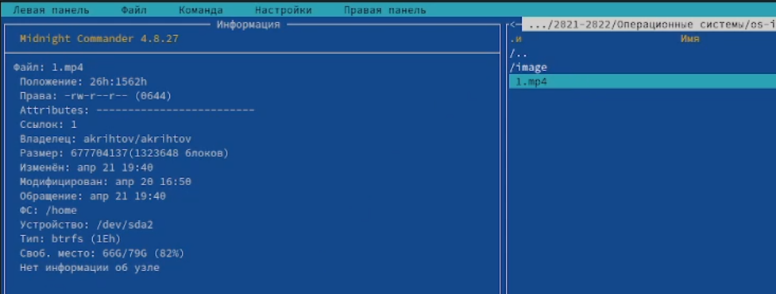

---
## Front matter
title: "Лабораторная работа №7"
subtitle: "Командная оболочка Midnight Commander"
author: "Рытов Алексей Константинович НФИбд-02-21"
lang: ru-RU

## Bibliography
bibliography: bib/cite.bib
csl: pandoc/csl/gost-r-7-0-5-2008-numeric.csl

## Pdf output format
toc-depth: 2
lof: true # List of figures
fontsize: 12pt
linestretch: 1.5
papersize: a4
documentclass: scrreprt
## I18n polyglossia
polyglossia-lang:
  name: russian
  options:
	- spelling=modern
	- babelshorthands=true
polyglossia-otherlangs:
  name: english
## I18n babel
babel-lang: russian
babel-otherlangs: english
## Fonts
mainfont: PT Serif
romanfont: PT Serif
sansfont: PT Sans
monofont: PT Mono
mainfontoptions: Ligatures=TeX
romanfontoptions: Ligatures=TeX
sansfontoptions: Ligatures=TeX,Scale=MatchLowercase
monofontoptions: Scale=MatchLowercase,Scale=0.9
## Biblatex
biblatex: true
biblio-style: "gost-numeric"
biblatexoptions:
  - parentracker=true
  - backend=biber
  - hyperref=auto
  - language=auto
  - autolang=other*
  - citestyle=gost-numeric
## Pandoc-crossref LaTeX customization
figureTitle: "Рис."
tableTitle: "Таблица"
listingTitle: "Листинг"
lofTitle: "Список иллюстраций"
lotTitle: "Список таблиц"
lolTitle: "Листинги"
## Misc options
indent: true
header-includes:
  - \usepackage{indentfirst}
  - \usepackage{float} # keep figures where there are in the text
  - \floatplacement{figure}{H} # keep figures where there are in the text

---

# Цель работы

Освоение основных возможностей командной оболочки Midnight Commander. Приобретение навыков практической работы по просмотру каталогов и файлов; манипуляций с ними.

# Теоретическое введение

Командная оболочка — интерфейс взаимодействия пользователя с операционной системой и программным обеспечением посредством команд.
Midnight Commander (или mc) — псевдографическая командная оболочка для UNIX/Linux
систем. Для запуска mc необходимо в командной строке набрать mc и нажать Enter .
Рабочее пространство mc имеет две панели, отображающие по умолчанию списки
файлов двух каталогов 

Над панелями располагается меню, доступ к которому осуществляется с помощью
клавиши F9 . Под панелями внизу расположены управляющие экранные кнопки, ассоциированные с функциональными клавишами F1 – F10 . Над ними располагается
командная строка, предназначенная для ввода команд.

В меню каждой (левой или правой) панели можно выбрать Формат списка :
– стандартный — выводит список файлов и каталогов с указанием размера и времени
правки;
– ускоренный — позволяет задать число столбцов, на которые разбивается панель при
выводе списка имён файлов или каталогов без дополнительной информации;
– расширенный — помимо названия файла или каталога выводит сведения о правах
доступа, владельце, группе, размере, времени правки;
– определённый пользователем — позволяет вывести те сведения о файле или каталоге,
которые задаст сам пользователь.
Подпункт меню Порядок сортировки позволяет задать критерии сортировки при выводе
списка файлов и каталогов: без сортировки, по имени, расширенный, время правки,
время доступа, время изменения атрибута, размер, узел.

– Переставить панели — меняет местами левую и правую панели.
– Сравнить каталоги ( Ctrl-x d ) — сравнивает содержимое двух каталогов.
– Размеры каталогов — отображает размер и время изменения каталога (по умолчанию
в mc размер каталога корректно не отображается).
– История командной строки — выводит на экран список ранее выполненных в оболочке
команд.
– Каталоги быстрого доступа ( Ctrl-\ ) — пр вызове выполняется быстрая смена текущего
каталога на один из заданного списка.
– Восстановление файлов — позволяет восстановить файлы на файловых системах ext2
и ext3.
– Редактировать файл расширений — позволяет задать с помощью определённого синтаксиса действия при запуске файлов с определённым расширением (например, какое
программного обеспечение запускать для открытия или редактирования файлов с расширением doc или docx).
– Редактировать файл меню — позволяет отредактировать контекстное меню пользователя, вызываемое по клавише F2 .
– Редактировать файл расцветки имён — позволяет подобрать оптимальную для пользователя расцветку имён файлов в зависимости от их типа.

# Выполнение лабораторной работы

7.3.1:

1. Изучили информацию о mc, вызвав в командной строке man mc(рис. 1).

2. Запустили из командной строки mc, изучили его структуру и меню(рис. 2).

3. Выполнили несколько операций в mc, используя управляющие клавиши(рис. 3-7).

4. Выполнили основные команды меню левой (или правой) панели. Оценили степень
подробности вывода информации о файлах.

5. Используя возможности подменю Файл, выполнили(рис. 8-12):

6. С помощью соответствующих средств подменю Команда осуществили(рис. 13-18):

7. Вызвали подменю Настройки(рис. 19).

7.3.2:

1. Создали текстовой файл text.txt(рис. 20).

2. Открыли этот файл с помощью встроенного в mc редактора(рис. 21).
3. Вставили в открытый файл небольшой фрагмент текста, скопированный из Интернета(рис. 21).

4. Проделали с текстом следующие манипуляции, используя горячие клавиши(рис. 22-28):

5. Открыли файл с исходным текстом на языке C(рис. 29).
6. Используя меню редактора, выключили подсветку синтаксиса(рис. 29).

# Выводы

Освоили основные возможности командной оболочки Midnight Commander. Приобрели навыки практической работы по просмотру каталогов и файлов, а также по манипуляции с ними.

# Ответы на контрольные вопросы:

1. Какие режимы работы есть в mc. Охарактеризуйте их.

2. Какие операции с файлами можно выполнить как с помощью команд shell, так и с помощью меню (комбинаций клавиш) mc? 
Приведите несколько примеров.

Можно копировать, вставлять файлы, править и удалять их.

3. Опишите структура меню левой (или правой) панели mc, дайте характеристику командам.

Структура левой: 
1. Список ФАЙЛОВ: 
2. Быстрый просмотр: Вывод содержимого файла без его открытия
3. Информация: выводит информацию о файле
4. Дерево: выводит дерево каталогов на левой панели

4. Опишите структура меню Файл mc, дайте характеристику командам.

Структура меню:
1. Просмотр файла: просмотр файла
2. Просмотр вывода команды: показывает вывод введенной команды

5. Опишите структура меню Команда mc, дайте характеристику командам.

Структура Команды:
1. Выводит меню пользователя
2. Поиск файла: осуществляет поиск файла по заданным критериям

6. Опишите структура меню Настройки mc, дайте характеристику командам.

Внешний вид: именение внешнего вида mc

7. Назовите и дайте характеристику встроенным командам mc.

8. Назовите и дайте характеристику командам встроенного редактора mc.

9. Дайте характеристику средствам mc, которые позволяют создавать меню, определяемые пользователем.

10. Дайте характеристику средствам mc, которые позволяют выполнять действия, определяемые пользователем, над текущим файлом.