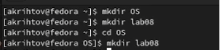
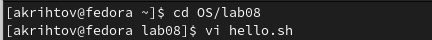
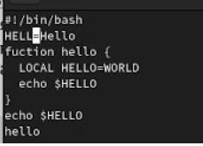
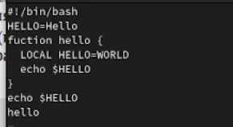
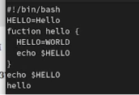
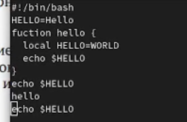
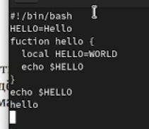
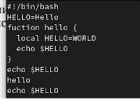
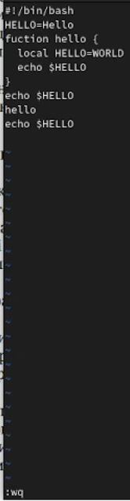

---
## Front matter
title: "Лабораторная работа №8"
subtitle: "Текстовый редактор vi"
author: "Рытов Алексей Константинович НФИбд-02-21"
lang: ru-RU

## Bibliography
bibliography: bib/cite.bib
csl: pandoc/csl/gost-r-7-0-5-2008-numeric.csl

## Pdf output format
toc-depth: 2
lof: true # List of figures
fontsize: 12pt
linestretch: 1.5
papersize: a4
documentclass: scrreprt
## I18n polyglossia
polyglossia-lang:
  name: russian
  options:
	- spelling=modern
	- babelshorthands=true
polyglossia-otherlangs:
  name: english
## I18n babel
babel-lang: russian
babel-otherlangs: english
## Fonts
mainfont: PT Serif
romanfont: PT Serif
sansfont: PT Sans
monofont: PT Mono
mainfontoptions: Ligatures=TeX
romanfontoptions: Ligatures=TeX
sansfontoptions: Ligatures=TeX,Scale=MatchLowercase
monofontoptions: Scale=MatchLowercase,Scale=0.9
## Biblatex
biblatex: true
biblio-style: "gost-numeric"
biblatexoptions:
  - parentracker=true
  - backend=biber
  - hyperref=auto
  - language=auto
  - autolang=other*
  - citestyle=gost-numeric
## Pandoc-crossref LaTeX customization
figureTitle: "Рис."
tableTitle: "Таблица"
listingTitle: "Листинг"
lofTitle: "Список иллюстраций"
lotTitle: "Список таблиц"
lolTitle: "Листинги"
## Misc options
indent: true
header-includes:
  - \usepackage{indentfirst}
  - \usepackage{float} # keep figures where there are in the text
  - \floatplacement{figure}{H} # keep figures where there are in the text

---

# Цель работы

Познакомиться с операционной системой Linux. Получить практические навыки работы с редактором vi, установленным по умолчанию практически во всех дистрибутивах.

# Теоретическое введение

В большинстве дистрибутивов Linux в качестве текстового редактора по умолчанию
устанавливается интерактивный экранный редактор vi (Visual display editor).
Редактор vi имеет три режима работы:
– командный режим — предназначен для ввода команд редактирования и навигации по
редактируемому файлу;
– режим вставки — предназначен для ввода содержания редактируемого файла;
– режим последней (или командной) строки — используется для записи изменений в файл
и выхода из редактора.
Для вызова редактора vi необходимо указать команду vi и имя редактируемого файла:
vi <имя_файла>
При этом в случае отсутствия файла с указанным именем будет создан такой файл.
Переход в командный режим осуществляется нажатием клавиши Esc . Для выхода из
редактора vi необходимо перейти в режим последней строки: находясь в командном
режиме, нажать Shift-; (по сути символ : — двоеточие), затем:
– набрать символы wq, если перед выходом из редактора требуется записать изменения
в файл;
– набрать символ q (или q!), если требуется выйти из редактора без сохранения.

8.2.1.2. Команды позиционирования

– 0 (ноль) — переход в начало строки;
– $ — переход в конец строки;
– G — переход в конец файла;
– 𝑛 G — переход на строку с номером 𝑛.

8.2.1.3. Команды перемещения по файлу

– Ctrl-d — перейти на пол-экрана вперёд;
– Ctrl-u — перейти на пол-экрана назад;
– Ctrl-f — перейти на страницу вперёд;
– Ctrl-b — перейти на страницу назад.

8.2.1.4. Команды перемещения по словам1

– W или w — перейти на слово вперёд;
– 𝑛 W или 𝑛 w — перейти на 𝑛 слов вперёд;
– b или B — перейти на слово назад;
– 𝑛 b или 𝑛 B — перейти на 𝑛 слов назад.

8.2.2. Команды редактирования
8.2.2.1. Вставка текста

– а — вставить текст после курсора;
– А — вставить текст в конец строки;
– i — вставить текст перед курсором;
– 𝑛 i — вставить текст 𝑛 раз;
– I — вставить текст в начало строки.

8.2.2.2. Вставка строки

– о — вставить строку под курсором;
– О — вставить строку над курсором.

8.2.2.3. Удаление текста

– x — удалить один символ в буфер;
– d w — удалить одно слово в буфер;
– d $ — удалить в буфер текст от курсора до конца строки;
– d 0 — удалить в буфер текст от начала строки до позиции курсора;
– d d — удалить в буфер одну строку;
– 𝑛 d d — удалить в буфер 𝑛 строк.

8.2.2.4. Отмена и повтор произведённых изменений

– u — отменить последнее изменение;
– . — повторить последнее изменение.

8.2.2.5. Копирование текста в буфер

– Y — скопировать строку в буфер;
– 𝑛 Y — скопировать 𝑛 строк в буфер;
– y w — скопировать слово в буфер.

8.2.2.6. Вставка текста из буфера

– p — вставить текст из буфера после курсора;
– P — вставить текст из буфера перед курсором.

8.2.2.7. Замена текста

– c w — заменить слово;
– 𝑛 c w — заменить 𝑛 слов;
– c $ — заменить текст от курсора до конца строки;
– r — заменить слово;
– R — заменить текст.

8.2.2.8. Поиск текста

– / текст — произвести поиск вперёд по тексту указанной строки символов текст;
– ? текст — произвести поиск назад по тексту указанной строки символов текст.

8.2.3. Команды редактирования в режиме командной строки

8.2.3.1. Копирование и перемещение текста

– : 𝑛,𝑚 d — удалить строки с 𝑛 по 𝑚;
– : 𝑖,𝑗 m 𝑘 — переместить строки с 𝑖 по 𝑗, начиная со строки 𝑘;
– : 𝑖,𝑗 t 𝑘 — копировать строки с 𝑖 по 𝑗 в строку 𝑘;
– : 𝑖,𝑗 w имя-файла — записать строки с 𝑖 по 𝑗 в файл с именем имя-файла.

8.2.3.2. Запись в файл и выход из редактора

– : w — записать изменённый текст в файл, не выходя из vi;
– : w имя-файла — записать изменённый текст в новый файл с именем имя-файла;
– : w ! имя-файла — записать изменённый текст в файл с именем имя-файла;
– : w q — записать изменения в файл и выйти из vi;
– : q — выйти из редактора vi;
– : q ! — выйти из редактора без записи;

# Выполнение лабораторной работы

8.3.1:

1. Создали каталог с именем ~/OS/lab08(рис. 1).

2. Перешли во вновь созданный каталог(рис. 2).
3. Вызвали vi и создали файл hello.sh(рис. 2).

4. Нажали клавишу i и ввели текст представленный в лабораторной работе(рис. 3).
5. Нажали клавишу Esc для перехода в командный режим после завершения ввода текста(рис. 3).
6. Нажали : для перехода в режим последней строки(рис. 3).
7. Нажали w (записать) и q (выйти), а затем нажали клавишу Enter для сохранения текста и завершения работы(рис. 3).

8. Сделали файл исполняемым.

8.3.2:

1. Вызвали vi на редактирование файла(рис. 5).

2. Установили курсор в конец слова HELL второй строки(рис. 6).

3. Перешли в режим вставки и заменили HELL на HELLO. Нажали Esc для возврата в командный режим(рис. 7).

4. Установили курсор на четвертую строку и стёрли слово LOCAL(рис. 8).

5. Перешли в режим вставки и наберали следующий текст: local, нажмали Esc для возврата в командный режим(рис. 9).
6. Установили курсор на последней строке файла. Вставили после неё строку, содержащую
следующий текст: echo $HELLO(рис. 9).

7. Нажали Esc для перехода в командный режим(рис. 10).
8. Удалили последнюю строку(рис. 10).

9. Ввели команду отмены изменений u для отмены последней команды(рис. 11).

10. Ввели символ : для перехода в режим последней строки. Записали произведённые изменения и вышли из vi(рис. 12).

# Выводы

Познакомились с операционной системой Linux. Получили практические навыки работы с редактором vi.

# Ответы на контрольные вопросы:

1. Дайте краткую характеристику режимам работы редактора vi.

командный режим: В этом режиме можно давать команды для редактирования файлов или перейти в другой режим.

режим ввода: Находясь в режиме ввода, можно вводить текст в то место, куда указывает курсор.

режим последней строки: В этом режиме в последнюю строку вводится команда, после чего нажимается клавиша Enter, и команда исполняется.

2. Как выйти из редактора, не сохраняя произведённые изменения?

q

3. Назовите и дайте краткую характеристику командам позиционирования.

4. Что для редактора vi является словом?

текст с пробелами с обеих сторон

5. Каким образом из любого места редактируемого файла перейти в начало (конец)
файла?

home; end; 

6. Назовите и дайте краткую характеристику основным группам команд редактирования.

8.2.1.2. Команды позиционирования
– 0 (ноль) — переход в начало строки;
– $ — переход в конец строки;
– G — переход в конец файла;
– 𝑛 G — переход на строку с номером 𝑛.
8.2.1.3. Команды перемещения по файлу
– Ctrl-d — перейти на пол-экрана вперёд;
– Ctrl-u — перейти на пол-экрана назад;
– Ctrl-f — перейти на страницу вперёд;
– Ctrl-b — перейти на страницу назад.
8.2.1.4. Команды перемещения по словам1
– W или w — перейти на слово вперёд;
– 𝑛 W или 𝑛 w — перейти на 𝑛 слов вперёд;
– b или B — перейти на слово назад;
– 𝑛 b или 𝑛 B — перейти на 𝑛 слов назад.
8.2.2. Команды редактирования
8.2.2.1. Вставка текста
– а — вставить текст после курсора;
– А — вставить текст в конец строки;
– i — вставить текст перед курсором;
– 𝑛 i — вставить текст 𝑛 раз;
– I — вставить текст в начало строки.
8.2.2.2. Вставка строки
– о — вставить строку под курсором;
– О — вставить строку над курсором.
8.2.2.3. Удаление текста
– x — удалить один символ в буфер;
– d w — удалить одно слово в буфер;
– d $ — удалить в буфер текст от курсора до конца строки;
– d 0 — удалить в буфер текст от начала строки до позиции курсора;
– d d — удалить в буфер одну строку;
– 𝑛 d d — удалить в буфер 𝑛 строк.

7. Необходимо заполнить строку символами $. Каковы ваши действия?

– c $ — заменить текст от курсора до конца строки;

8. Как отменить некорректное действие, связанное с процессом редактирования?

клавишей u

9. Назовите и дайте характеристику основным группам команд режима последней строки.

8.2.3.1. Копирование и перемещение текста
– : 𝑛,𝑚 d — удалить строки с 𝑛 по 𝑚;
– : 𝑖,𝑗 m 𝑘 — переместить строки с 𝑖 по 𝑗, начиная со строки 𝑘;
– : 𝑖,𝑗 t 𝑘 — копировать строки с 𝑖 по 𝑗 в строку 𝑘;
– : 𝑖,𝑗 w имя-файла — записать строки с 𝑖 по 𝑗 в файл с именем имя-файла.
8.2.3.2. Запись в файл и выход из редактора
– : w — записать изменённый текст в файл, не выходя из vi;
– : w имя-файла — записать изменённый текст в новый файл с именем имя-файла;
– : w ! имя-файла — записать изменённый текст в файл с именем имя-файла;
– : w q — записать изменения в файл и выйти из vi;
– : q — выйти из редактора vi;
– : q ! — выйти из редактора без записи;

10. Как определить, не перемещая курсора, позицию, в которой заканчивается строка?

11. Выполните анализ опций редактора vi (сколько их, как узнать их назначение и т.д.).

Опции редактора vi позволяют настроить рабочую среду. Для задания опций используется команда set (в режиме последней строки):
– : set all — вывести полный список опций;
– : set nu — вывести номера строк;
– : set list — вывести невидимые символы;
– : set ic — не учитывать при поиске, является ли символ прописным или строчным.
Если вы хотите отказаться от использования опции, то в команде set перед именем
опции надо поставить no.

12. Как определить режим работы редактора vi?

снизу в левом углу должна быть надпись, обозначающая режим

13. Постройте граф взаимосвязи режимов работы редактора vi.