---
## Front matter
title: "Лабораторная работа №9"
subtitle: "Текстовый редактор emacs"
author: "Рытов Алексей Константинович НФИбд-02-21"
lang: ru-RU

## Bibliography
bibliography: bib/cite.bib
csl: pandoc/csl/gost-r-7-0-5-2008-numeric.csl

## Pdf output format
toc-depth: 2
lof: true # List of figures
fontsize: 12pt
linestretch: 1.5
papersize: a4
documentclass: scrreprt
## I18n polyglossia
polyglossia-lang:
  name: russian
  options:
	- spelling=modern
	- babelshorthands=true
polyglossia-otherlangs:
  name: english
## I18n babel
babel-lang: russian
babel-otherlangs: english
## Fonts
mainfont: PT Serif
romanfont: PT Serif
sansfont: PT Sans
monofont: PT Mono
mainfontoptions: Ligatures=TeX
romanfontoptions: Ligatures=TeX
sansfontoptions: Ligatures=TeX,Scale=MatchLowercase
monofontoptions: Scale=MatchLowercase,Scale=0.9
## Biblatex
biblatex: true
biblio-style: "gost-numeric"
biblatexoptions:
  - parentracker=true
  - backend=biber
  - hyperref=auto
  - language=auto
  - autolang=other*
  - citestyle=gost-numeric
## Pandoc-crossref LaTeX customization
figureTitle: "Рис."
tableTitle: "Таблица"
listingTitle: "Листинг"
lofTitle: "Список иллюстраций"
lotTitle: "Список таблиц"
lolTitle: "Листинги"
## Misc options
indent: true
header-includes:
  - \usepackage{indentfirst}
  - \usepackage{float} # keep figures where there are in the text
  - \floatplacement{figure}{H} # keep figures where there are in the text

---

# Цель работы

Познакомиться с операционной системой Linux. Получить практические навыки работы с редактором Emacs.

# Теоретическое введение

Emacs представляет собой мощный экранный редактор текста, написанный на языке
высокого уровня Elisp.

Определение 1. Буфер — объект, представляющий какой-либо текст.
Буфер может содержать что угодно, например, результаты компиляции программы
или встроенные подсказки. Практически всё взаимодействие с пользователем, в том
числе интерактивное, происходит посредством буферов.

Определение 2. Фрейм соответствует окну в обычном понимании этого слова. Каждый
фрейм содержит область вывода и одно или несколько окон Emacs.

Определение 3. Окно — прямоугольная область фрейма, отображающая один из буферов.
Каждое окно имеет свою строку состояния, в которой выводится следующая информация: название буфера, его основной режим, изменялся ли текст буфера и как далеко вниз
по буферу расположен курсор. Каждый буфер находится только в одном из возможных
основных режимов. Существующие основные режимы включают режим Fundamental
(наименее специализированный), режим Text, режим Lisp, режим С, режим Texinfo
и другие. Под второстепенными режимами понимается список режимов, которые включены в данный момент в буфере выбранного окна.

Определение 4. Область вывода — одна или несколько строк внизу фрейма, в которой
Emacs выводит различные сообщения, а также запрашивает подтверждения и дополнительную информацию от пользователя.

Определение 5. Минибуфер используется для ввода дополнительной информации и всегда отображается в области вывода.

Определение 6. Точка вставки — место вставки (удаления) данных в буфере.

Основы работы в Emacs:

Для запуска Emacs необходимо в командной строке набрать emacs (или emacs & для
работы в фоновом режиме относительно консоли).
Для работы с Emacs можно использовать как элементы меню, так и различные сочетания клавиш. Например, для выхода из Emacs можно воспользоваться меню File
и выбрать пункт Quit , а можно нажать последовательно Ctrl-x Ctrl-c (в обозначениях
Emacs: C-x C-c).

Многие рутинные операции в Emacs удобнее производить с помощью клавиатуры, а не
графического меню. Наиболее часто в командах Emacs используются сочетания c клавишами Ctrl и Meta (в обозначениях Emacs: C- и M-; клавиша Shift в Emasc обозначается
как S-). Так как на клавиатуре для IBM PC совместимых ПК клавиши Meta нет, то вместо
неё можно использовать Alt или Esc . Для доступа к системе меню используйте клавишу
F10 .

Клавиши Ctrl , Meta и Shift принято называть префиксными. Например, запись M-x
означает, что надо удерживая клавишу Meta (или Alt ), нажать на клавишу x.Для открытия
файла следует использовать команду C-x C-f (надо, удерживая клавишу Ctrl , нажать на
клавишу x , затем отпустить обе клавиши и снова, удерживая клавишу Ctrl , нажать на
клавишу f ).

По назначению префиксные сочетания клавиш различаются следующим образом:
– C-x — префикс ввода основных команд редактора (например, открытия, закрытии,
сохранения файла и т.д.);
– C-c — префикс вызова функций, зависящих от используемого режима.

Определение 7. Режим — пакет расширений, изменяющий поведение буфера Emacs при
редактировании и просмотре текста (например, для редактирования исходного текста
программ на языках С или Perl).

# Выполнение лабораторной работы

1. Открыли emacs.
2. Создали файл lab09.sh с помощью комбинации Ctrl-x Ctrl-f (C-x C-f).
3. Набрали текст из лабораторной работы.
4. Сохранили файл с помощью комбинации Ctrl-x Ctrl-s (C-x C-s).

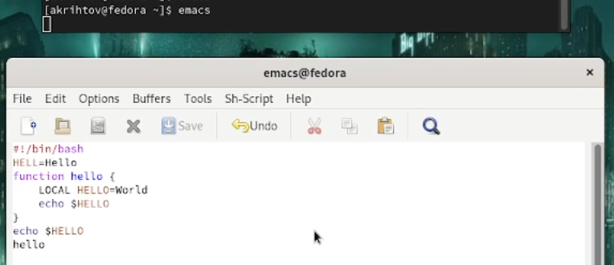

5.1. Вырезали одной командой целую строку (С-k).

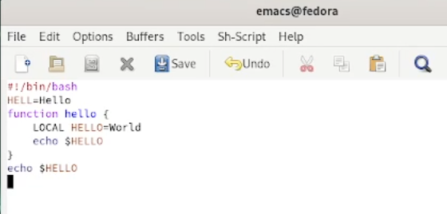

5.2. Вставили эту строку в конец файла (C-y).

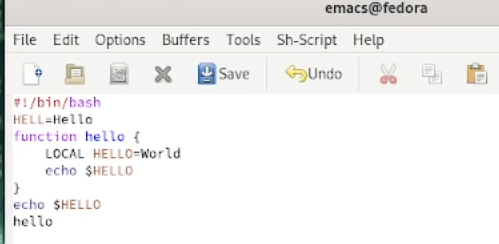

5.3. Выделили область текста (C-space).

5.4. Скопировали область в буфер обмена (M-w).

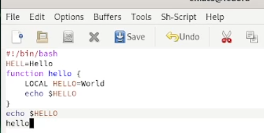

5.5. Вставили область в конец файла.

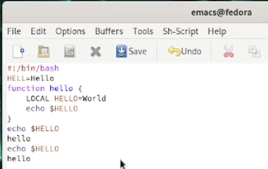

5.6. Вновь выделили эту область и вырезали её (C-w).

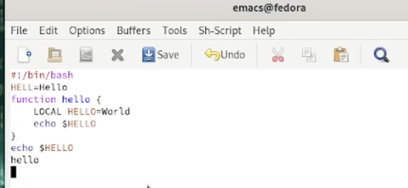

5.7. Отменили последнее действие (C-/).

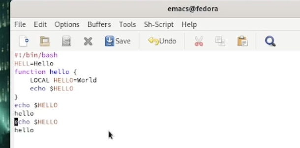

6.1. Переместили курсор в начало строки (C-a).

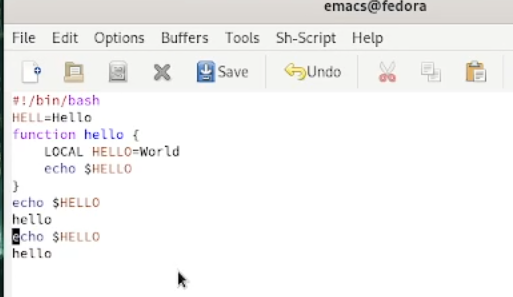

6.2. Переместите курсор в конец строки (C-e).

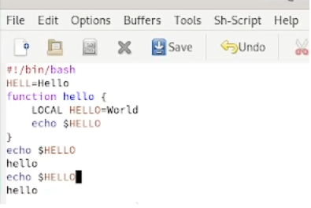

6.3. Переместите курсор в начало буфера (M-<).

6.4. Переместите курсор в конец буфера (M->).

7.1. Вывели список активных буферов на экран (C-x C-b).

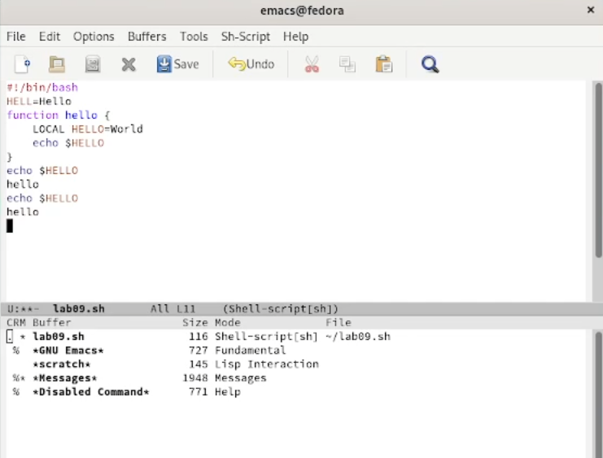

7.2. Переместились во вновь открытое окно (C-x) o со списком открытых буферов
и переключились на другой буфер.

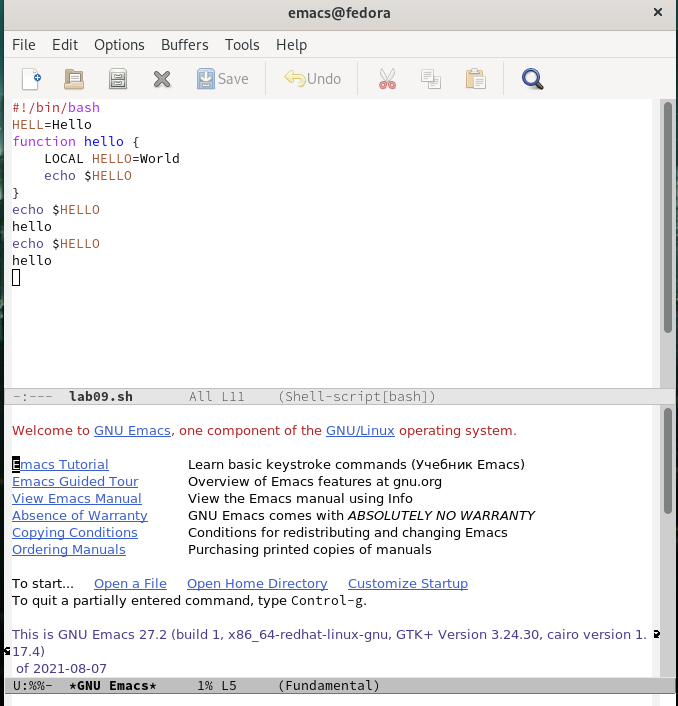

7.3. Закрыли это окно (C-x 0).

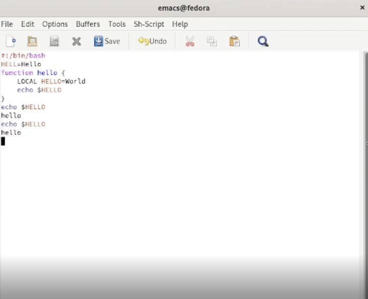

7.4. Теперь вновь переключились между буферами, но уже без вывода их списка на
экран (C-x b).

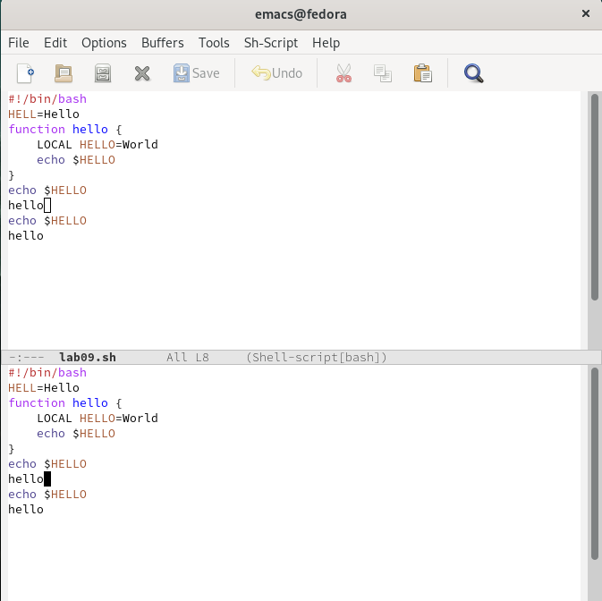

8.1. Поделили фрейм на 4 части: разделили фрейм на два окна по вертикали (C-x 3),
а затем каждое из этих окон на две части по горизонтали (C-x 2).

8.2. В каждом из четырёх созданных окон открыли новый буфер (файл) и ввели
несколько строк текста.

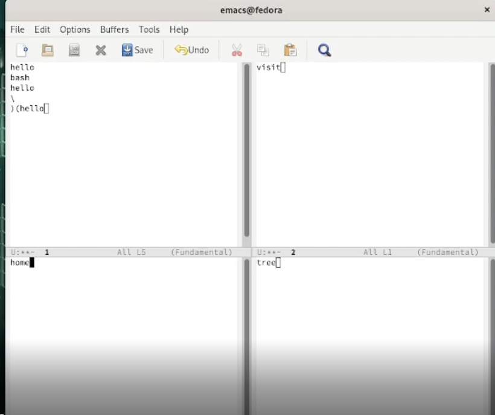

9.1. Переключились в режим поиска (C-s) и найдите несколько слов, присутствующих
в тексте.

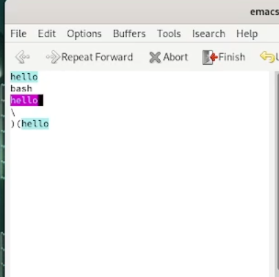

9.2. Переключились между результатами поиска, нажимая C-s.

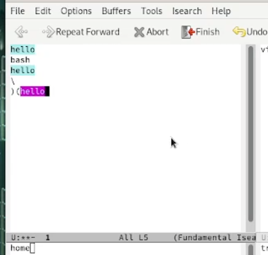

9.3. Вышли из режима поиска, нажав C-g.

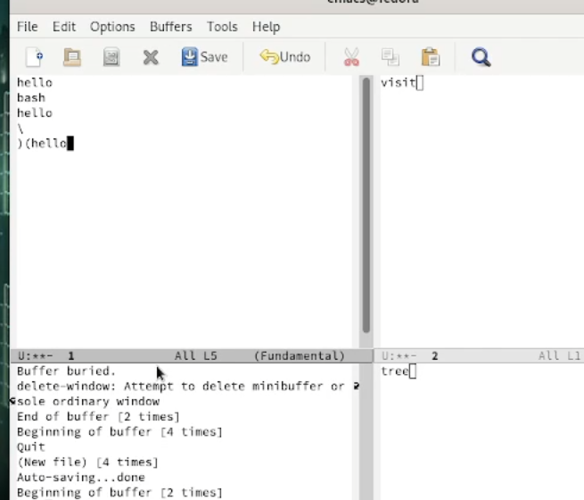

9.4. Перешли в режим поиска и замены (M-%), ввели текст, который следует найти
и заменить, нажали Enter , затем ввели текст для замены. Подтвердили замену.
9.5. Испробовали другой режим поиска, нажав M-s o, который отличается тем, что показывает количество вхождений.

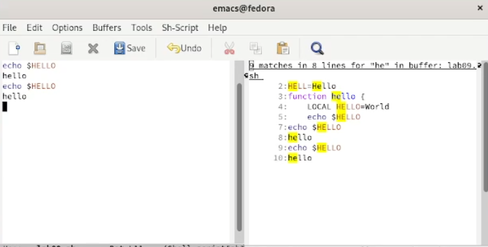

# Выводы

Мы познакомились с операционной системой Linux. Получили практические навыки работы с редактором Emacs.

# Ответы на контрольные вопросы:

1. Кратко охарактеризуйте редактор emacs.

Emacs представляет собой мощный экранный редактор текста, написанный на языке
высокого уровня Elisp.

2. Какие особенности данного редактора могут сделать его сложным для освоения новичком?

встреча с новыми терминами

3. Своими словами опишите, что такое буфер и окно в терминологии emacs’а.

буфер - область текста
окно - область, отображающая буфер

4. Можно ли открыть больше 10 буферов в одном окне?

нет

5. Какие буферы создаются по умолчанию при запуске emacs?

scratch

6. Какие клавиши вы нажмёте, чтобы ввести следующую комбинацию C-c | и C-c C-|?

ctrl + c, |

ctrl + c, ctrl + |

7. Как поделить текущее окно на две части?

C-x 3

8. В каком файле хранятся настройки редактора emacs?

.emacs

9. Какую функцию выполняет клавиша и можно ли её переназначить?

10. Какой редактор вам показался удобнее в работе vi или emacs? Поясните почему.

редактор emacs приятнее чисто визуально