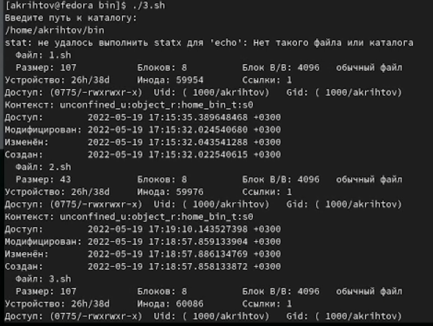

---
## Front matter
title: "Лабораторная работа №10"
subtitle: "Программирование в командном процессоре OC UNIX. Командные файлы"
author: "Рытов Алексей Константинович НФИбд-02-21"
lang: ru-RU

## Bibliography
bibliography: bib/cite.bib
csl: pandoc/csl/gost-r-7-0-5-2008-numeric.csl

## Pdf output format
toc-depth: 2
lof: true # List of figures
fontsize: 12pt
linestretch: 1.5
papersize: a4
documentclass: scrreprt
## I18n polyglossia
polyglossia-lang:
  name: russian
  options:
	- spelling=modern
	- babelshorthands=true
polyglossia-otherlangs:
  name: english
## I18n babel
babel-lang: russian
babel-otherlangs: english
## Fonts
mainfont: PT Serif
romanfont: PT Serif
sansfont: PT Sans
monofont: PT Mono
mainfontoptions: Ligatures=TeX
romanfontoptions: Ligatures=TeX
sansfontoptions: Ligatures=TeX,Scale=MatchLowercase
monofontoptions: Scale=MatchLowercase,Scale=0.9
## Biblatex
biblatex: true
biblio-style: "gost-numeric"
biblatexoptions:
  - parentracker=true
  - backend=biber
  - hyperref=auto
  - language=auto
  - autolang=other*
  - citestyle=gost-numeric
## Pandoc-crossref LaTeX customization
figureTitle: "Рис."
tableTitle: "Таблица"
listingTitle: "Листинг"
lofTitle: "Список иллюстраций"
lotTitle: "Список таблиц"
lolTitle: "Листинги"
## Misc options
indent: true
header-includes:
  - \usepackage{indentfirst}
  - \usepackage{float} # keep figures where there are in the text
  - \floatplacement{figure}{H} # keep figures where there are in the text

---

# Цель работы

Изучить основы программирования в оболочке ОС UNIX/Linux. Научиться писать
небольшие командные файлы.

# Теоретическое введение

Командный процессор (командная оболочка, интерпретатор команд shell) — это программа, позволяющая пользователю взаимодействовать с операционной системой
компьютера. В операционных системах типа UNIX/Linux наиболее часто используются
следующие реализации командных оболочек:
– оболочка Борна (Bourne shell или sh) — стандартная командная оболочка UNIX/Linux,
содержащая базовый, но при этом полный набор функций;
– С-оболочка (или csh) — надстройка на оболочкой Борна, использующая С-подобный
синтаксис команд с возможностью сохранения истории выполнения команд;
– оболочка Корна (или ksh) — напоминает оболочку С, но операторы управления программой совместимы с операторами оболочки Борна;
– BASH — сокращение от Bourne Again Shell (опять оболочка Борна), в основе своей совмещает свойства оболочек С и Корна (разработка компании Free Software Foundation).
POSIX (Portable Operating System Interface for Computer Environments) — набор стандартов
описания интерфейсов взаимодействия операционной системы и прикладных программ.
Стандарты POSIX разработаны комитетом IEEE (Institute of Electrical and Electronics
Engineers) для обеспечения совместимости различных UNIX/Linux-подобных операционных систем и переносимости прикладных программ на уровне исходного кода.
POSIX-совместимые оболочки разработаны на базе оболочки Корна.
Рассмотрим основные элементы программирования в оболочке bash. В других оболочках большинство команд будет совпадать с описанными ниже.

Командный процессор bash обеспечивает возможность использования переменных
типа строка символов. Имена переменных могут быть выбраны пользователем. Пользователь имеет возможность присвоить переменной значение некоторой строки символов.
Например, команда

mark=/usr/andy/bin

присваивает значение строки символов /usr/andy/bin переменной mark типа строка
символов.
Значение, присвоенное некоторой переменной, может быть впоследствии использовано. Для этого в соответствующем месте командной строки должно быть употреблено
имя этой переменной, которому предшествует метасимвол $. Например, команда

mv afile ${mark}

Оболочка bash поддерживает встроенные арифметические функции. Команда let
является показателем того, что последующие аргументы представляют собой выражение,
подлежащее вычислению. Простейшее выражение — это единичный терм (term), обычно
целочисленный.
Целые числа можно записывать как последовательность цифр или в любом базовом
формате типа radix\#number, где radix (основание системы счисления) — любое число не более 26. Для большинства команд используются следующие основания систем
исчисления: 2 (двоичная), 8 (восьмеричная) и 16 (шестнадцатеричная). Простейшими
математическими выражениями являются сложение (+), вычитание (-), умножение (*),
целочисленное деление (/) и целочисленный остаток от деления (%).
Команда let берет два операнда и присваивает их переменной. Положительным моментом команды let можно считать то, что для идентификации переменной ей не
нужен знак доллара; вы можете писать команды типа let sum=x+7, и let будет искать
переменную x и добавлять к ней 7.
Команда let также расширяет другие выражения let, если они заключены в двойные
круглые скобки. Таким способом вы можете создавать довольно сложные выражения.
Команда let не ограничена простыми арифметическими выражениями. Табл. 10.1
показывает полный набор let-операций.
Подобно С оболочка bash может присваивать переменной любое значение, а произвольное выражение само имеет значение, которое может использоваться. При этом «ноль»
воспринимается как «ложь», а любое другое значение выражения — как «истина». Для сказанного является выполнение некоторого действия, одновременно декрементируя
некоторое значение. например:

1 $ let x=5

2 $ while

3 > (( x-=1 ))

4 > do

5 > something

6 > done

Этот пример показывает выполнение некоторого действия с начальным значением 5,
которое декрементирует до тех пор, пока оно не будет равно нулю. При каждой итерации
выполняется функция something.
Наиболее распространённым является сокращение, избавляющееся от слова let в программах оболочек. Если объявить переменные целыми значениями, то любое присвоение
автоматически будет трактоваться как арифметическое действие. Если использовать
typeset -i для объявления и присвоения переменной, то при последующем её применении она станет целой. Также можно использовать ключевое слово integer (псевдоним
для typeset -i) и объявлять таким образом переменные целыми. Выражения типа х=y+z
будет восприниматься в это случае как арифметические.
Команда read позволяет читать значения переменных со стандартного ввода:

1 echo "Please enter Month and Day of Birth ?"

2 read mon day trash

В переменные mon и day будут считаны соответствующие значения, введённые с клавиатуры, а переменная trash нужна для того, чтобы отобрать всю избыточно введённую
информацию и игнорировать её.
Изъять переменную из программы можно с помощью команды unset.
Имена некоторых переменных имеют для командного процессора специальный смысл.
Значением переменной PATH (т.е. $РАТН) является список каталогов, в которых командный процессор осуществляет поиск программы или команды, указанной в командной
строке, в том случае, если указанное имя программы или команды не содержит ни
одного символа /. Если имя команды содержит хотя бы один символ /, то последовательность поиска, предписываемая значением переменной PATH, нарушается. В этом случае
в зависимости от того, является имя команды абсолютным или относительным, поиск
начинается соответственно от корневого или текущего каталога.
Если Вы сами явно не присвоите переменной PATH какое-либо значение, то стандартной (по умолчанию) последовательностью поиска файла является следующая: текущий
каталог, каталог /bin, каталог /usr/bin. Именно в такой последовательности командный
процессор ищет файлы, содержащие программы, которые обеспечивают выполнение
таких, например, команд, как echo, ls и cat.
В списке каталогов, являющемся значением переменной PATH, имена каталогов отделяются друг от друга с помощью символа двоеточия. В качестве примера приведём
команду:

1 PATH=~/bin:/usr/local/bin/:/bin:/usr/bin

Переменные PS1 и PS2 предназначены для отображения промптера командного процессора. PS1 — это промптер командного процессора, по умолчанию его значение равно
символу $ или #. Если какая-то интерактивная программа, запущенная командным
процессором, требует ввода, то используется промптер PS2. Он по умолчанию имеет
значение символа >.
Другие стандартные переменные:
– HOME — имя домашнего каталога пользователя. Если команда cd вводится без аргументов, то происходит переход в каталог, указанный в этой переменной.
– IFS — последовательность символов, являющихся разделителями в командной строке,
например, пробел, табуляция и перевод строки (new line).
– MAIL — командный процессор каждый раз перед выводом на экран промптера проверяет содержимое файла, имя которого указано в этой переменной, и если содержимое
этого файла изменилось с момента последнего ввода из него, то перед тем как вывести
на терминал промптер, командный процессор выводит на терминал сообщение You
have mail (у Вас есть почта).

– TERM — тип используемого терминала.

– LOGNAME — содержит регистрационное имя пользователя, которое устанавливается

автоматически при входе в систему.
В командном процессоре Си имеется ещё несколько стандартных переменных. Значение всех переменных можно просмотреть с помощью команды set.

# Выполнение лабораторной работы

1. Создали четыре исполняемых файла и установили для них права доступа(рис. 1).

2. Написали скрипт 1.sh и запустили его(рис. 2-3).

3. Написали скрипт 2.sh и запустили его(рис. 4-5).

4. Написали скрипт 3.sh и запустили его(рис. 6-7).

5. Написали скрипт 4.sh и запустили его(рис. 8-9).

# Выводы

Мы изучили основы программирования в оболочке ОС UNIX/Linux, научились писать
небольшие командные файлы.

# Ответы на контрольные вопросы:

1. Объясните понятие командной оболочки. Приведите примеры командных оболочек.
Чем они отличаются?

Кома́ндная оболо́чка Unix (англ. Unix shell, часто просто «шелл» или «sh») — командный интерпретатор, используемый в операционных системах семейства Unix, в котором пользователь может либо давать команды операционной системе по отдельности, либо запускать скрипты, состоящие из списка команд.

2. Что такое POSIX?

POSIX (англ. Portable Operating System Interface — переносимый интерфейс операционных систем) — набор стандартов, описывающих интерфейсы между операционной системой и прикладной программой (системный API), библиотеку языка C и набор приложений и их интерфейсов. Стандарт создан для обеспечения совместимости различных UNIX-подобных операционных систем и переносимости прикладных программ на уровне исходного кода, но может быть использован и для не-Unix систем.

3. Как определяются переменные и массивы в языке программирования bash?

set -A states Delaware Michigan "New Jersey"

4. Каково назначение операторов let и read?

Команда let берет два операнда и присваивает их переменной. Положительным моментом команды let можно считать то, что для идентификации переменной ей не
нужен знак доллара; вы можете писать команды типа let sum=x+7, и let будет искать
переменную x и добавлять к ней 7.

Команда read позволяет читать значения переменных со стандартного ввода:

echo "Please enter Month and Day of Birth ?"

read mon day trash

В переменные mon и day будут считаны соответствующие значения, введённые с клавиатуры, а переменная trash нужна для того, чтобы отобрать всю избыточно введённую
информацию и игнорировать её.

5. Какие арифметические операции можно применять в языке программирования bash?

+, -, *, /, %

6. Что означает операция (( ))?

в нее записываются условия

7. Какие стандартные имена переменных Вам известны?

PATH

– HOME — имя домашнего каталога пользователя. Если команда cd вводится без аргументов, то происходит переход в каталог, указанный в этой переменной.

– IFS — последовательность символов, являющихся разделителями в командной строке,
например, пробел, табуляция и перевод строки (new line).

– MAIL — командный процессор каждый раз перед выводом на экран промптера проверяет содержимое файла, имя которого указано в этой переменной, и если содержимое
этого файла изменилось с момента последнего ввода из него, то перед тем как вывести
на терминал промптер, командный процессор выводит на терминал сообщение You
have mail (у Вас есть почта).

– TERM — тип используемого терминала.

– LOGNAME — содержит регистрационное имя пользователя, которое устанавливается
автоматически при входе в систему

8. Что такое метасимволы?

символы позволяющие работать с переменными

9. Как экранировать метасимволы?

Для экранирования группы метасимволов нужно заключить её в одинарные кавычки. Строка, заключённая в двойные кавычки, экранирует все метасимволы, кроме
$, ' , \, ". Например,
– echo \* выведет на экран символ *,
– echo ab’*\|*’cd выведет на экран строку ab*\|*cd.

10. Как создавать и запускать командные файлы?

touch <имя_файла> 

chmod +x <имя_файла>

./<имя_файла>

11. Как определяются функции в языке программирования bash?

12. Каким образом можно выяснить, является файл каталогом или обычным файлом?

13. Каково назначение команд set, typeset и unset?

Наиболее распространённым является сокращение, избавляющееся от слова let в программах оболочек. Если объявить переменные целыми значениями, то любое присвоение
автоматически будет трактоваться как арифметическое действие. Если использовать
typeset -i для объявления и присвоения переменной, то при последующем её применении она станет целой. Также можно использовать ключевое слово integer (псевдоним
для typeset -i) и объявлять таким образом переменные целыми. Выражения типа х=y+z
будет восприниматься в это случае как арифметические.

14. Как передаются параметры в командные файлы?

15. Назовите специальные переменные языка bash и их назначение.

Специальные переменные $* и $@ содержат все позиционные параметры (аргументы командной строки).