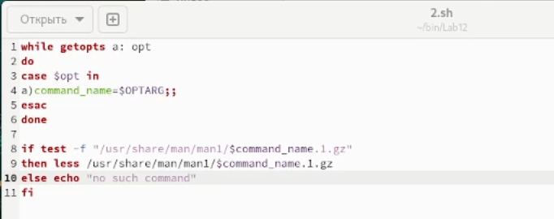
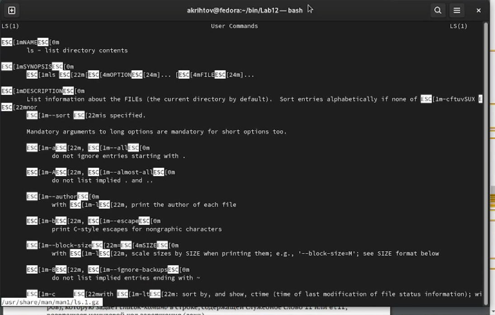
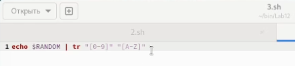
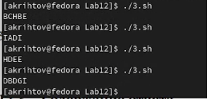

---
## Front matter
title: "Лабораторная работа №12"
subtitle: "Программирование в командном процессоре OC UNIX. Расширенное программирование"
author: "Рытов Алексей Константинович НФИбд-02-21"
lang: ru-RU

## Bibliography
bibliography: bib/cite.bib
csl: pandoc/csl/gost-r-7-0-5-2008-numeric.csl

## Pdf output format
toc-depth: 2
lof: true # List of figures
fontsize: 12pt
linestretch: 1.5
papersize: a4
documentclass: scrreprt
## I18n polyglossia
polyglossia-lang:
  name: russian
  options:
	- spelling=modern
	- babelshorthands=true
polyglossia-otherlangs:
  name: english
## I18n babel
babel-lang: russian
babel-otherlangs: english
## Fonts
mainfont: PT Serif
romanfont: PT Serif
sansfont: PT Sans
monofont: PT Mono
mainfontoptions: Ligatures=TeX
romanfontoptions: Ligatures=TeX
sansfontoptions: Ligatures=TeX,Scale=MatchLowercase
monofontoptions: Scale=MatchLowercase,Scale=0.9
## Biblatex
biblatex: true
biblio-style: "gost-numeric"
biblatexoptions:
  - parentracker=true
  - backend=biber
  - hyperref=auto
  - language=auto
  - autolang=other*
  - citestyle=gost-numeric
## Pandoc-crossref LaTeX customization
figureTitle: "Рис."
tableTitle: "Таблица"
listingTitle: "Листинг"
lofTitle: "Список иллюстраций"
lotTitle: "Список таблиц"
lolTitle: "Листинги"
## Misc options
indent: true
header-includes:
  - \usepackage{indentfirst}
  - \usepackage{float} # keep figures where there are in the text
  - \floatplacement{figure}{H} # keep figures where there are in the text

---

# Цель работы

Изучить основы программирования в оболочке ОС UNIX. Научиться писать более
сложные командные файлы с использованием логических управляющих конструкций
и циклов.

# Выполнение лабораторной работы

1. Реализовали команду man с помощью командного файла. 

2. Используя встроенную переменную $RANDOM, написали командный файл, генерирующий случайную последовательность букв латинского алфавита.

# Выводы

Мы изучили основы программирования в оболочке ОС UNIX. Научились писать более
сложные командные файлы с использованием логических управляющих конструкций
и циклов.

# Ответы на контрольные вопросы:

1. Найдите синтаксическую ошибку в следующей строке:

while [$1 != "exit"]

отсутсвуют пробелы рядом с квадратными скобками

2. Как объединить (конкатенация) несколько строк в одну?

VAR1="Hello,"

VAR2=" World"

VAR3="$VAR1$VAR2"

echo "$VAR3"

3. Найдите информацию об утилите seq. Какими иными способами можно реализовать
её функционал при программировании на bash?

4. Какой результат даст вычисление выражения $((10/3))?

3,(3)

5. Укажите кратко основные отличия командной оболочки zsh от bash.

Zsh более интерактивный и настраиваемый, чем Bash.

У Zsh есть поддержка с плавающей точкой, которой нет у Bash.

В Zsh поддерживаются структуры хеш-данных, которых нет в Bash.

Функции вызова в Bash лучше по сравнению с Zsh.

6. Проверьте, верен ли синтаксис данной конструкции
for ((a=1; a <= LIMIT; a++))

верен

7. Сравните язык bash с какими-либо языками программирования. Какие преимущества
у bash по сравнению с ними? Какие недостатки?

hell-сценарий — исходный файл, специально созданный для интерпретатора командной строки типа Bash. Программисты обычно пишут Shell-сценарии для повышения производительности за счет автоматизации повторяющихся задач, таких как:

обработка файлов;
установка среды;
запуск тестовых стеков и развертывания.
Кроме того, Shell-сценарии используются внутри виртуальных машин или CI/CD сервисов, обеспечивая чистые и настраиваемые тестовые прогоны или развертывания.