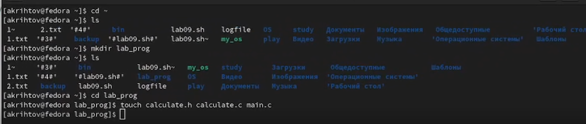
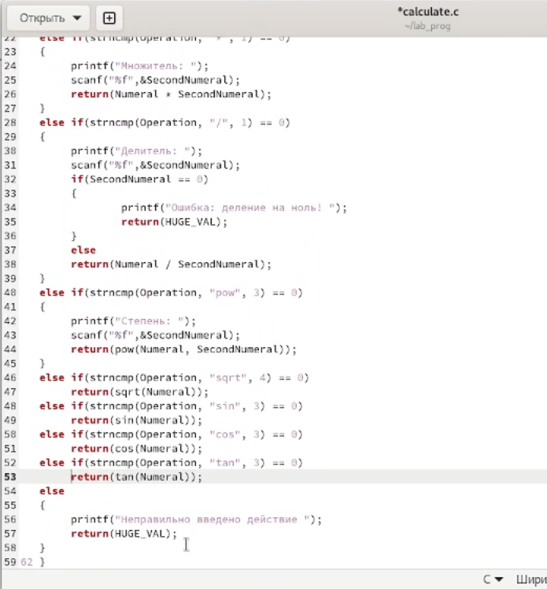
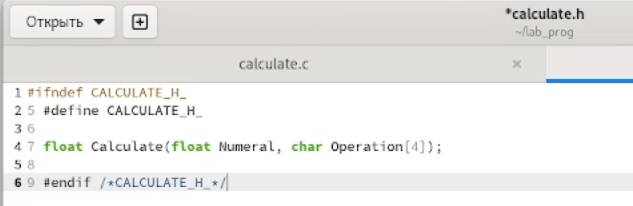
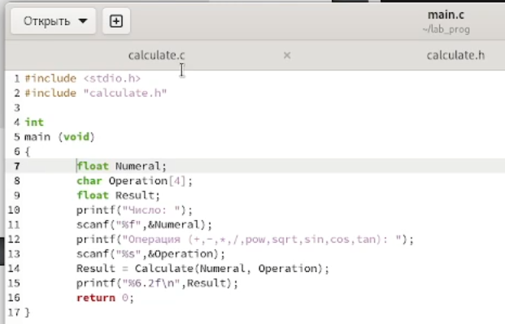
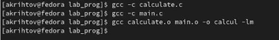
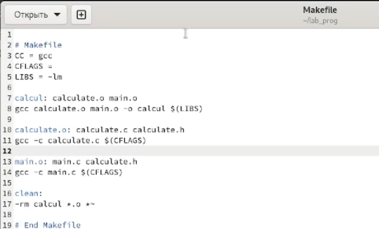
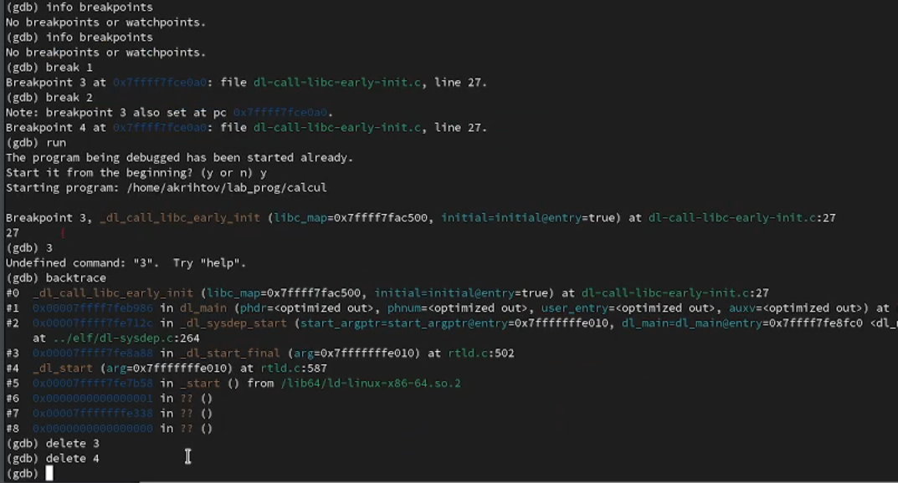
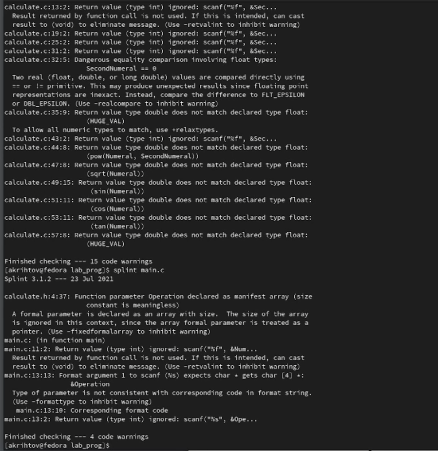

---
## Front matter
title: "Лабораторная работа №13"
subtitle: "Средства, применяемые при разработке программного обеспечения в ОС типа UNIX/Linux"
author: "Рытов Алексей Константинович НФИбд-02-21"
lang: ru-RU

## Bibliography
bibliography: bib/cite.bib
csl: pandoc/csl/gost-r-7-0-5-2008-numeric.csl

## Pdf output format
toc-depth: 2
lof: true # List of figures
fontsize: 12pt
linestretch: 1.5
papersize: a4
documentclass: scrreprt
## I18n polyglossia
polyglossia-lang:
  name: russian
  options:
	- spelling=modern
	- babelshorthands=true
polyglossia-otherlangs:
  name: english
## I18n babel
babel-lang: russian
babel-otherlangs: english
## Fonts
mainfont: PT Serif
romanfont: PT Serif
sansfont: PT Sans
monofont: PT Mono
mainfontoptions: Ligatures=TeX
romanfontoptions: Ligatures=TeX
sansfontoptions: Ligatures=TeX,Scale=MatchLowercase
monofontoptions: Scale=MatchLowercase,Scale=0.9
## Biblatex
biblatex: true
biblio-style: "gost-numeric"
biblatexoptions:
  - parentracker=true
  - backend=biber
  - hyperref=auto
  - language=auto
  - autolang=other*
  - citestyle=gost-numeric
## Pandoc-crossref LaTeX customization
figureTitle: "Рис."
tableTitle: "Таблица"
listingTitle: "Листинг"
lofTitle: "Список иллюстраций"
lotTitle: "Список таблиц"
lolTitle: "Листинги"
## Misc options
indent: true
header-includes:
  - \usepackage{indentfirst}
  - \usepackage{float} # keep figures where there are in the text
  - \floatplacement{figure}{H} # keep figures where there are in the text

---

# Цель работы

Приобрести простейшие навыки разработки, анализа, тестирования и отладки приложений в ОС типа UNIX/Linux на примере создания на языке программирования
С калькулятора с простейшими функциями.

# Выполнение лабораторной работы

1. В домашнем каталоге создали подкаталог ~/lab_prog.
2. Создали в нём файлы: calculate.h, calculate.c, main.c.

3. Выполнили компиляцию программы посредством gcc.

5. Создали Makefile.

6. С помощью gdb выполнили отладку программы calcul, запустили её.

7. Создание, удаление и работа с breakpoint.

8. С помощью утилиты splint проанализировали коды файлов calculate.c
и main.c.

# Выводы

Мы приобрели простейшие навыки разработки, анализа, тестирования и отладки приложений в ОС типа UNIX/Linux на примере создания на языке программирования
С калькулятора с простейшими функциями.

# Контрольные вопросы

1. Как получить информацию о возможностях программ gcc, make, gdb и др.?
2. Назовите и дайте краткую характеристику основным этапам разработки приложений
в UNIX.
3. Что такое суффикс в контексте языка программирования? Приведите примеры использования.
4. Каково основное назначение компилятора языка С в UNIX?
5. Для чего предназначена утилита make?
6. Приведите пример структуры Makefile. Дайте характеристику основным элементам
этого файла.
7. Назовите основное свойство, присущее всем программам отладки. Что необходимо
сделать, чтобы его можно было использовать?
8. Назовите и дайте основную характеристику основным командам отладчика gdb.
9. Опишите по шагам схему отладки программы, которую Вы использовали при выполнении лабораторной работы.
10. Прокомментируйте реакцию компилятора на синтаксические ошибки в программе
при его первом запуске.
11. Назовите основные средства, повышающие понимание исходного кода программы.
12. Каковы основные задачи, решаемые программой splint?