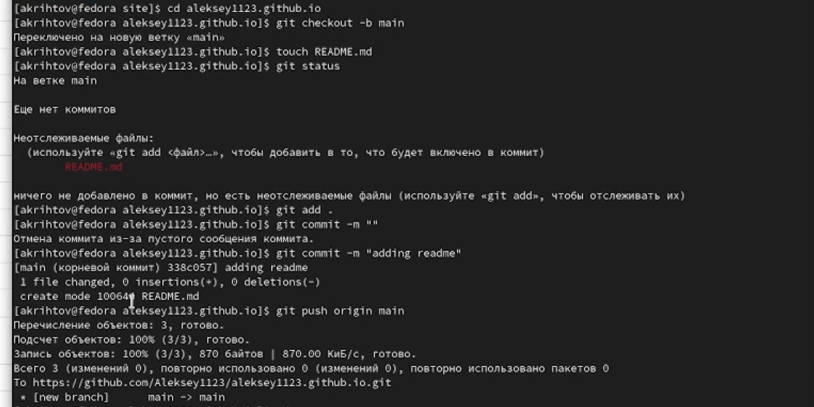

---
## Front matter
title: "Отчёт к индивидуальному проекту №1"
subtitle: "Размещение на Github pages заготовков для персонального сайта."
author: "Рытов Алексей Константинович НФИбд-02-21"
lang: ru-RU

## Bibliography
bibliography: bib/cite.bib
csl: pandoc/csl/gost-r-7-0-5-2008-numeric.csl

## Pdf output format
toc-depth: 2
lof: true # List of figures
fontsize: 12pt
linestretch: 1.5
papersize: a4
documentclass: scrreprt
## I18n polyglossia
polyglossia-lang:
  name: russian
  options:
	- spelling=modern
	- babelshorthands=true
polyglossia-otherlangs:
  name: english
## I18n babel
babel-lang: russian
babel-otherlangs: english
## Fonts
mainfont: PT Serif
romanfont: PT Serif
sansfont: PT Sans
monofont: PT Mono
mainfontoptions: Ligatures=TeX
romanfontoptions: Ligatures=TeX
sansfontoptions: Ligatures=TeX,Scale=MatchLowercase
monofontoptions: Scale=MatchLowercase,Scale=0.9
## Biblatex
biblatex: true
biblio-style: "gost-numeric"
biblatexoptions:
  - parentracker=true
  - backend=biber
  - hyperref=auto
  - language=auto
  - autolang=other*
  - citestyle=gost-numeric
## Pandoc-crossref LaTeX customization
figureTitle: "Рис."
tableTitle: "Таблица"
listingTitle: "Листинг"
lofTitle: "Список иллюстраций"
lotTitle: "Список таблиц"
lolTitle: "Листинги"
## Misc options
indent: true
header-includes:
  - \usepackage{indentfirst}
  - \usepackage{float} # keep figures where there are in the text
  - \floatplacement{figure}{H} # keep figures where there are in the text

---

# Цель работы

Разместить на Github pages заготовки для персонального сайта.

# Задание

-Установить необходимое программное обеспечение. 
-Скачать шаблон темы сайта. 
-Разместить его на хостинге git. 
-Установить параметр для URLs сайта. 
-Разместить заготовку сайта на Github pages.

# Ход работы

1. Создали две директории в github'е. Первая будет служить в качестве ссылки и также в ней будут лежать статические файлы. А вторая для шаблона сайта.(рис. 3.1-2)

---

2. Клонировали в папку site оба репозитория с github'а с помощью git clone.(рис. 3.3)

---

3. Скачали исполнимый файл hugo_extended для последующего билдинга сайта.(рис. 3.4)

---

4. Открыли в текстовом редакторе файл bashrc для того, чтобы прописать путь до исполняемого фала. А после распаковали архив с исполняемым файлом в папку bin.(рис 3.5-7)

---

5. Создали новую ветку под названием main, создали README файл и сделали коммит, а затем загрузили изменения на сервер.(рис 3.8)

---

6. Создали submodule в папке blog и забилдили сайт.(рис 3.9-10)

---

7. Создание коммита и выгрузка на сервер всех изменений.(рис 3.11-13)

---

8. Сам шаблонный сайт, который у нас получился.(рис 3.14)

# Выводы

Мы научились создавать сайты по шаблонам с помощью hugo на платформе github pages.