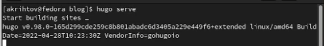
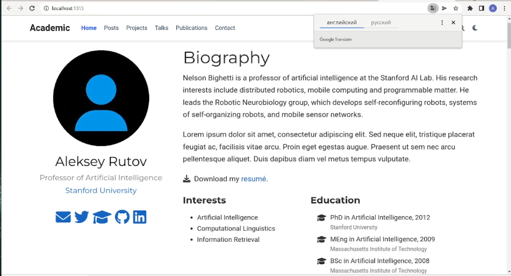
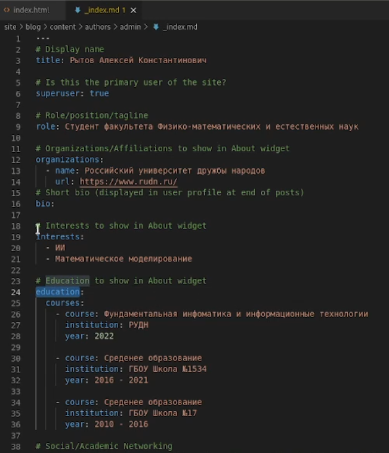
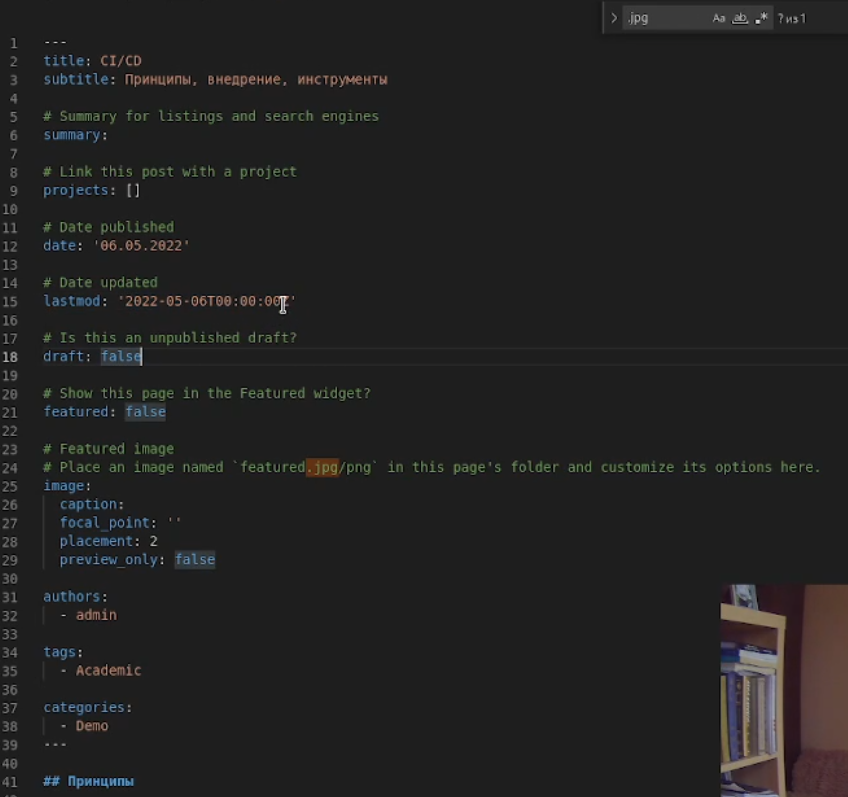
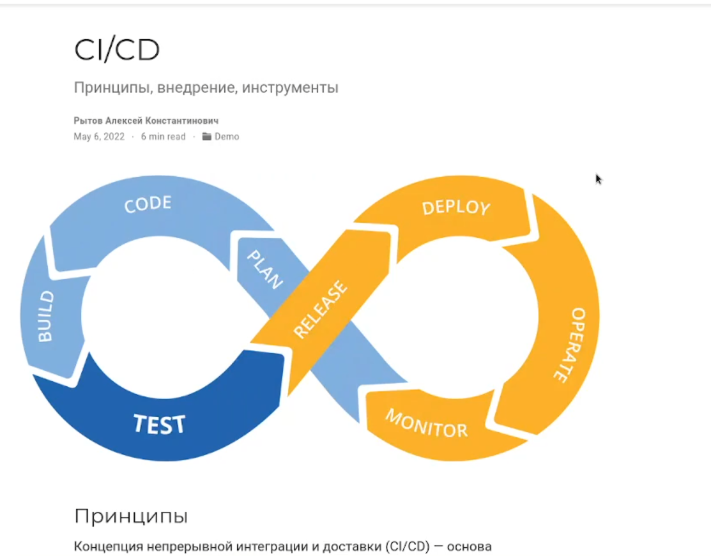
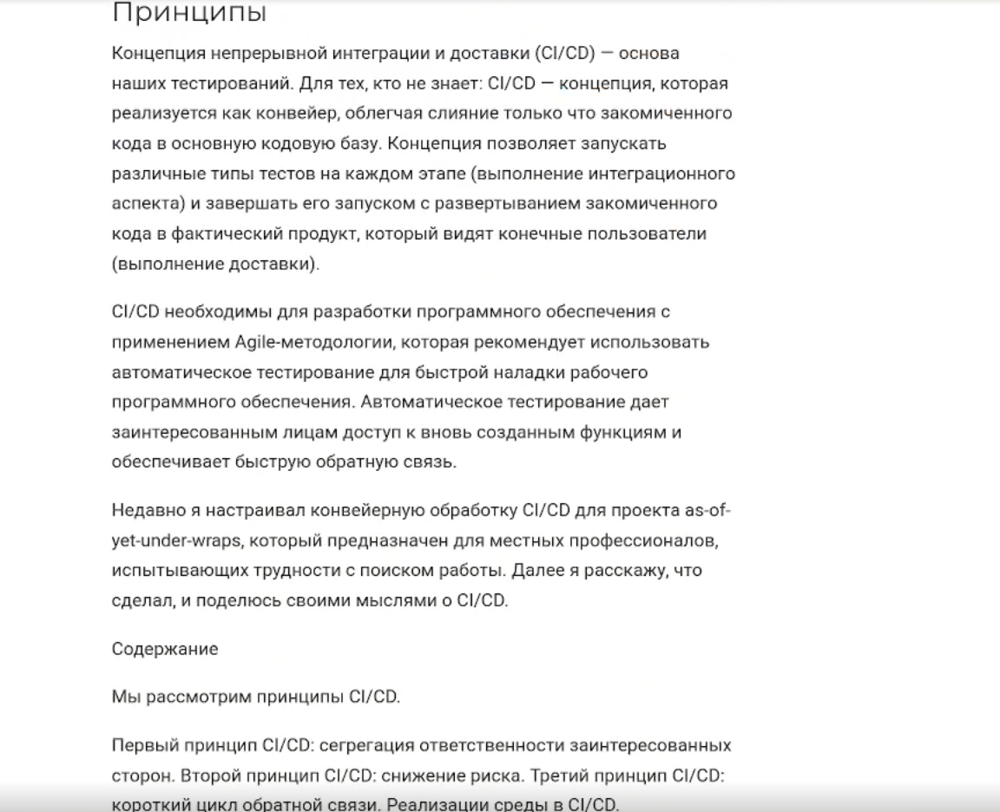
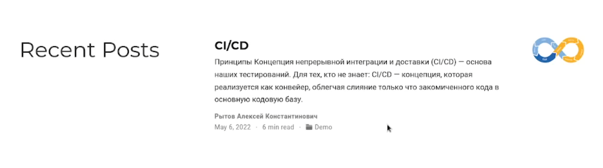
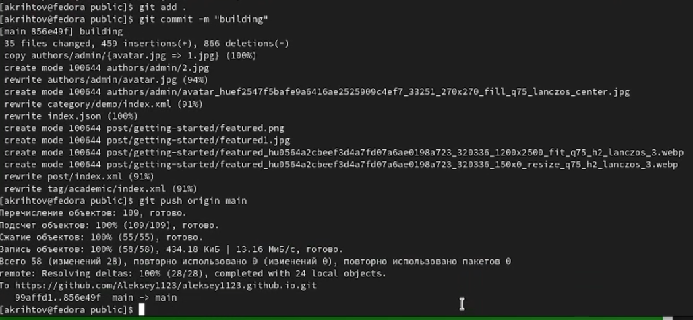
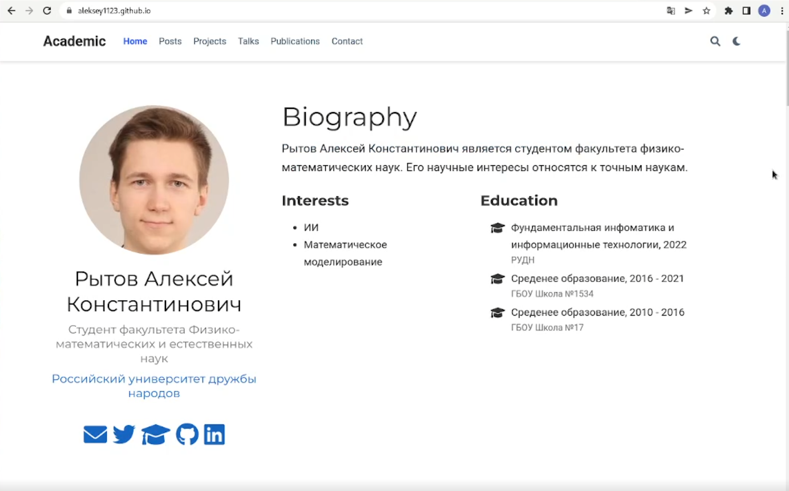

---
## Front matter
title: "Отчёт к индивидуальному проекту №2"
subtitle: "Добавить к сайту данные о себе."
author: "Рытов Алексей Константинович НФИбд-02-21"
lang: ru-RU

## Bibliography
bibliography: bib/cite.bib
csl: pandoc/csl/gost-r-7-0-5-2008-numeric.csl

## Pdf output format
toc-depth: 2
lof: true # List of figures
fontsize: 12pt
linestretch: 1.5
papersize: a4
documentclass: scrreprt
## I18n polyglossia
polyglossia-lang:
  name: russian
  options:
	- spelling=modern
	- babelshorthands=true
polyglossia-otherlangs:
  name: english
## I18n babel
babel-lang: russian
babel-otherlangs: english
## Fonts
mainfont: PT Serif
romanfont: PT Serif
sansfont: PT Sans
monofont: PT Mono
mainfontoptions: Ligatures=TeX
romanfontoptions: Ligatures=TeX
sansfontoptions: Ligatures=TeX,Scale=MatchLowercase
monofontoptions: Scale=MatchLowercase,Scale=0.9
## Biblatex
biblatex: true
biblio-style: "gost-numeric"
biblatexoptions:
  - parentracker=true
  - backend=biber
  - hyperref=auto
  - language=auto
  - autolang=other*
  - citestyle=gost-numeric
## Pandoc-crossref LaTeX customization
figureTitle: "Рис."
tableTitle: "Таблица"
listingTitle: "Листинг"
lofTitle: "Список иллюстраций"
lotTitle: "Список таблиц"
lolTitle: "Листинги"
## Misc options
indent: true
header-includes:
  - \usepackage{indentfirst}
  - \usepackage{float} # keep figures where there are in the text
  - \floatplacement{figure}{H} # keep figures where there are in the text

---

# Цель работы

Добавить к сайту данные о себе.

# Задание

Список добавляемых данных.

-Разместить фотографию владельца сайта. 
-Разместить краткое описание владельца сайт(Biography). 
-Добавить информацию об интересах (Interests). 
-Добавить информацию от образовании (Education). 
-Сделать пост по прошедшей неделе  
-Добавить пост на тему по выбору:
 1) Управление версиями. Git.
 2) Непрерывная интеграция и непрерывное развертывание (CI/CD).

# Ход работы

1.  Сделали localhost с помощью команды hugo serve.

---

2. Открыли файл index.md в папке blog и ввели свои личные данные.

3. Открыли файл index.md в папке post и создали пост на тему CI/CD.

---

4. Создали коммит и отправили изменения на сервер.

5. Так выглядит итог нашей работы:

# Выводы

Мы получили навык работы с сайтами. А именно мы научились их редактировать.