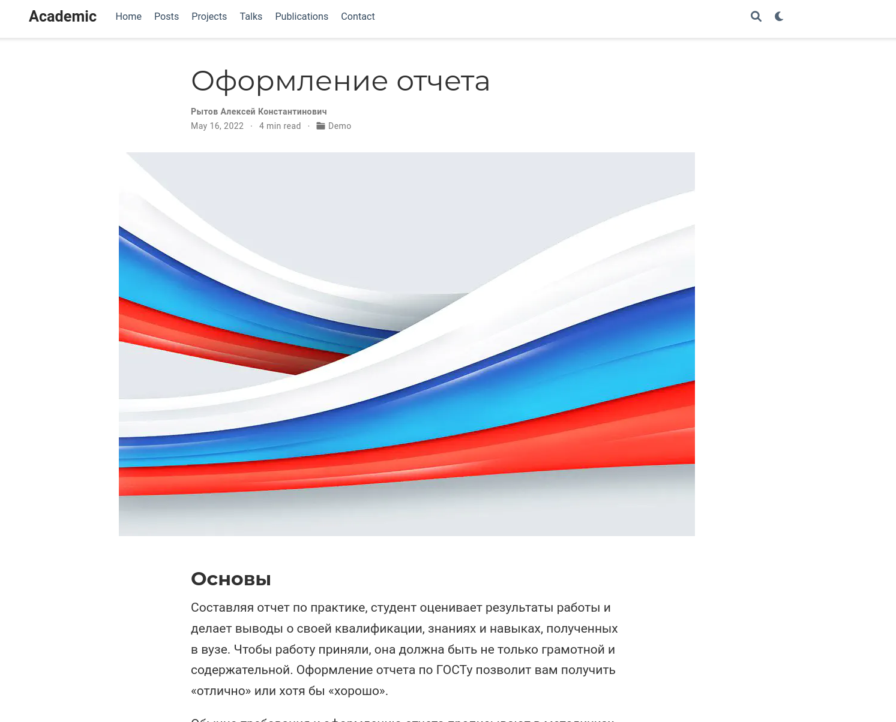

---
## Front matter
title: "Отчёт к индивидуальному проекту №4"
subtitle: "Добавить к сайту ссылки на научные и библиометрические ресурсы."
author: "Рытов Алексей Константинович НФИбд-02-21"
lang: ru-RU

## Bibliography
bibliography: bib/cite.bib
csl: pandoc/csl/gost-r-7-0-5-2008-numeric.csl

## Pdf output format
toc-depth: 2
lof: true # List of figures
fontsize: 12pt
linestretch: 1.5
papersize: a4
documentclass: scrreprt
## I18n polyglossia
polyglossia-lang:
  name: russian
  options:
	- spelling=modern
	- babelshorthands=true
polyglossia-otherlangs:
  name: english
## I18n babel
babel-lang: russian
babel-otherlangs: english
## Fonts
mainfont: PT Serif
romanfont: PT Serif
sansfont: PT Sans
monofont: PT Mono
mainfontoptions: Ligatures=TeX
romanfontoptions: Ligatures=TeX
sansfontoptions: Ligatures=TeX,Scale=MatchLowercase
monofontoptions: Scale=MatchLowercase,Scale=0.9
## Biblatex
biblatex: true
biblio-style: "gost-numeric"
biblatexoptions:
  - parentracker=true
  - backend=biber
  - hyperref=auto
  - language=auto
  - autolang=other*
  - citestyle=gost-numeric
## Pandoc-crossref LaTeX customization
figureTitle: "Рис."
tableTitle: "Таблица"
listingTitle: "Листинг"
lofTitle: "Список иллюстраций"
lotTitle: "Список таблиц"
lolTitle: "Листинги"
## Misc options
indent: true
header-includes:
  - \usepackage{indentfirst}
  - \usepackage{float} # keep figures where there are in the text
  - \floatplacement{figure}{H} # keep figures where there are in the text

---

# Цель работы

Добавить к сайту ссылки на научные и библиометрические ресурсы.

# Задание

-Зарегистрироваться на соответствующих ресурсах и разместить на них ссылки на сайте: 
  eLibrary : https://elibrary.ru/; 
  Google Scholar : https://scholar.google.com/; 
  ORCID : https://orcid.org/; 
  Mendeley : https://www.mendeley.com/; 
  ResearchGate : https://www.researchgate.net/; 
  Academia.edu : https://www.academia.edu/; 
  arXiv : https://arxiv.org/; 
  github : https://github.com/. 
-Сделать пост по прошедшей неделе. 
-Добавить пост на тему по выбору: 
  Оформление отчёта. 
  Создание презентаций. 
  Работа с библиографией.

# Ход работы

1. Создали localhost с помощью команды hugo serve(рис. 1).

2. Открыли файл index.md в папке admin и добавили свои данные(рис. 2).

3. Создали папку "3" и файл index.md в ней в папке post. Открыли файл index.md и создали пост на тему Оформление отчёта.(рис. 3-5).

4. Отправили данные на сервер и забилдили сайт(рис. 6).

# Выводы

Мы добавили к сайту ссылки на научные и библиометрические ресурсы.